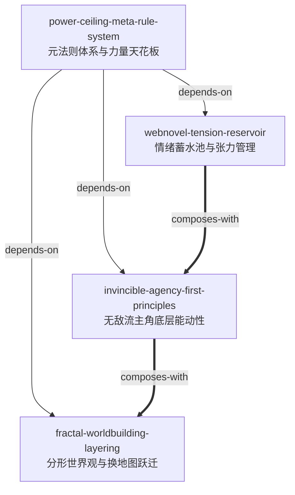

# 《帝霸》 — 网络文学创作与张力架构 Skill Index

> 本书由 cangjie-skill (RIA-TV++) 工业级流水线蒸馏，聚焦**网络文学创作论、长篇张力架构、无敌流人设与世界观体系**，共产出 **4** 个原子级 Claude Skills。
> 处理时间: 2026-08-21

## 关于这本书

- **书名**: 《帝霸》
- **作者**: 厌笔萧生
- **首发时间**: 2014年 (长篇连载中，共 7,218 章，66MB 纯文本)
- **一句话主旨**: 一个被夺魂化为阴鸦千万年的凡人少年，凭借永恒不磨的磐石道心与跨周期复利布局，幕后养成仙帝群雄，终极反抗苍天与收割巨头、主宰自身与万物命运。
- **整书理解与批判**: 见 [BOOK_OVERVIEW.md](./BOOK_OVERVIEW.md)
- **精华长文导读** (不读全书看这篇): [DIGEST.md](./DIGEST.md)
- **全书共享词典**: [GLOSSARY.md](./GLOSSARY.md)

---

## Skill 列表 (按创作维度分组)

### 叙事节奏与读者情绪管理

- [`webnovel-tension-reservoir`](./webnovel-tension-reservoir/SKILL.md) — 网文多层级情绪蓄水池与阶梯式张力释放模型，指导高潮铺垫、期待感蓄压与三段式打脸节奏编排。

### 角色内核与行为建模

- [`invincible-agency-first-principles`](./invincible-agency-first-principles/SKILL.md) — 无敌流主角高维认知差与底层能动性机制，指导运筹帷幄型主角塑造、决策逻辑推演与磐石道心稳态构建。

### 宏观世界观与长篇结构

- [`fractal-worldbuilding-layering`](./fractal-worldbuilding-layering/SKILL.md) — 分形世界观架构与跨界平稳跃迁模型，指导数百万字超长篇小说世界观扩展、平稳换地图与宏观冲突升级。

### 底层规则与力量体系设计

- [`power-ceiling-meta-rule-system`](./power-ceiling-meta-rule-system/SKILL.md) — 元法则体系（第一性原理）与力量天花板锚定系统，指导幻想类力量体系搭建、自创境界破界与天劫代价对冲。

---

## 引用与协同拓扑图



### 图例说明
- `-->` **depends-on (前置依赖)**: `power-ceiling-meta-rule-system` 是全书世界观的力量与逻辑底座，其余叙事与人设技能皆依赖此底层法则；
- `===>` **composes-with (高频组合)**: 情绪蓄水池、无敌能动性与分形世界观相互咬合，共同构成超长篇网文的创作中枢。

---

## 推荐学习与应用顺序

1. **第一步：建立底层力量法则**
   - 学习 [`power-ceiling-meta-rule-system`](./power-ceiling-meta-rule-system/SKILL.md)（搭建宇宙元法则与绝对天花板，防止战力崩坏）。
2. **第二步：塑造主角底层能动性**
   - 学习 [`invincible-agency-first-principles`](./invincible-agency-first-principles/SKILL.md)（为主角赋予高维认知与磐石道心，确立行动主线）。
3. **第三步：编排微观情节张力**
   - 学习 [`webnovel-tension-reservoir`](./webnovel-tension-reservoir/SKILL.md)（掌握章节与分卷的高潮铺垫、蓄水池管理与打脸节奏）。
4. **第四步：规划宏观长篇世界跃迁**
   - 学习 [`fractal-worldbuilding-layering`](./fractal-worldbuilding-layering/SKILL.md)（在主角横扫一界后，平稳开启新地图而不丢失老读者）。

---

## 安装使用

本目录为蒸馏构建产物。如需让 AI Agent 在日常写作与大纲构思中随时调用，可将 Skill 目录复制或安装至环境：

```bash
# 用户全局级 (所有项目可用)
cp -r books/di-ba/webnovel-tension-reservoir ~/.claude/skills/
cp -r books/di-ba/invincible-agency-first-principles ~/.claude/skills/
cp -r books/di-ba/fractal-worldbuilding-layering ~/.claude/skills/
cp -r books/di-ba/power-ceiling-meta-rule-system ~/.claude/skills/

# 或本项目级 (当前仓库 skills 目录)
cp -r books/di-ba/webnovel-tension-reservoir skills/
cp -r books/di-ba/invincible-agency-first-principles skills/
cp -r books/di-ba/fractal-worldbuilding-layering skills/
cp -r books/di-ba/power-ceiling-meta-rule-system skills/
```

---

## 接入 darwin-skill 自动进化

所有 Skill 均包含严格遵循 Darwin 规范的 `test-prompts.json`，支持一键接入进化流水线：

```bash
darwin evolve books/di-ba/
```

---

## 审计与追溯轨迹

- 流水线总状态: [PIPELINE_STATE.md](./PIPELINE_STATE.md)
- 整书结构分析: [BOOK_OVERVIEW.md](./BOOK_OVERVIEW.md)
- 三重验证清单: [verified.md](./verified.md)
- 原始候选单元池: [candidates/](./candidates/)
- 淘汰单元记录: [rejected/](./rejected/)
