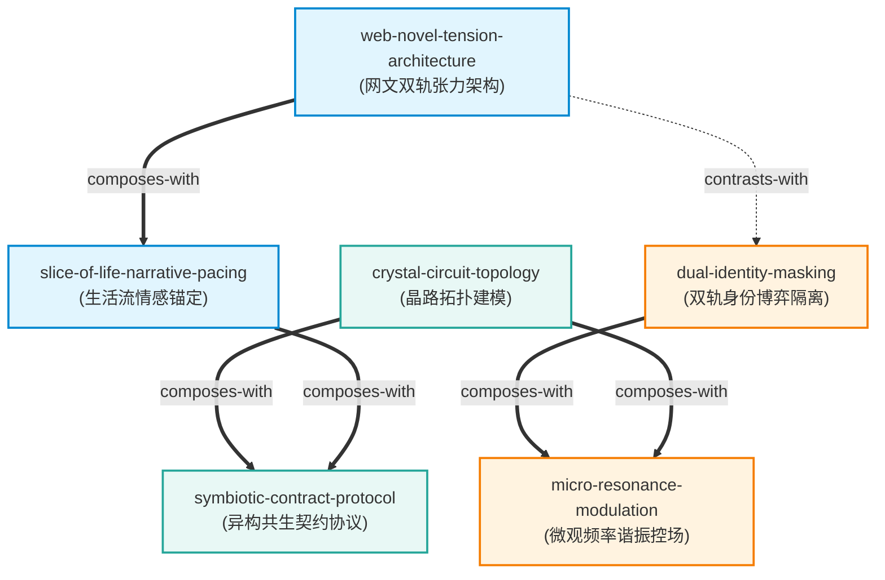

# 《赫氏门徒》 — 技能索引总览 (Skill Index)

> 本书由 `cangjie-skill` 深度蒸馏，共产出 **6** 个通过三重验证的高质量独立方法论 Skill。
> 处理时间: 2026-08-21

---

## 📖 关于这本书

- **书名**: 《赫氏门徒》
- **作者**: 冷钻
- **篇幅**: 42 集（卷）/ 50,845 行 / 约 274.4 万字
- **一句话主旨**: 通过双轨身份隔离与微观晶路/声波谐振，在多极强权冲突与宏大危机中以极低能耗实现精准破局，并依托温馨生活流与去神格化退场守住文明人性的自由主义史诗。
- **整书分析阅读**: 见 [BOOK_OVERVIEW.md](./BOOK_OVERVIEW.md)
- **精华长文导读**: 见 [DIGEST.md](./DIGEST.md)
- **共享术语词典**: 见 [GLOSSARY.md](./GLOSSARY.md)

---

## 🎯 Skill 列表 (按领域主题分组)

### 1. 叙事工程与网文创作 (Narrative Engineering & Fiction Craft)

- [`web-novel-tension-architecture`](./web-novel-tension-architecture/SKILL.md) — 网络文学双轨张力架构指南：基于“全知读者 vs 局内配角”认知差马甲、7:3 危机/日常配比与反高潮退场构建长篇超高粘性张力。
- [`slice-of-life-narrative-pacing`](./slice-of-life-narrative-pacing/SKILL.md) — 宏大叙事的生活流情感锚定与节奏调控框架：以微观烟火气细节（做饭/家务/斗嘴/逗宠）构建人物真实感，赋予战斗动机并完成终极力量的人性驯化。

### 2. 战略博弈与精准执行 (Strategy & Precision Execution)

- [`dual-identity-masking`](./dual-identity-masking/SKILL.md) — 双轨身份认知隔离与信息不对称博弈模型：构建低威胁日常探索态（冷羽态）与高威慑决断爆发态（龙羽态）的物理/信息隔离防火墙，实现高风险环境自保与定点破局。
- [`micro-resonance-modulation`](./micro-resonance-modulation/SKILL.md) — 微观频率谐振与精准控场框架：摒弃粗暴资源蛮力对轰，通过侦测对手节奏节拍并在极微能耗节点释放反相波干涉，实现四两拨千斤的结构性瓦解。

### 3. 系统工程与人机共生 (System Engineering & AI Symbiosis)

- [`crystal-circuit-topology`](./crystal-circuit-topology/SKILL.md) — 复杂黑盒系统的晶路拓扑建模法：将混沌高波动黑盒按“主魂、次魂、末魂”三级几何拓扑解耦，保留“遁去的一”底层安全冗余，实现能耗骤降 80% 与响应提速 5 倍。
- [`symbiotic-contract-protocol`](./symbiotic-contract-protocol/SKILL.md) — 高阶异构智能跨物种共生契约协议：颠覆单向权限代码锁奴役，建立基于“人格对等尊严、双向正和对齐、生活流共鸣与因果共担”的自主多 Agent 协同网络。

---

## 🗺️ 引用拓扑图 (Skill Dependency Graph)



**图例说明**:
- `===>` (composes-with): 组合协同（可同时激活产生复合倍增效应）
- `-.->` (contrasts-with): 领域对比（虚构创作 vs 现实博弈的范式映射）

---

## 📈 推荐学习与实践路径

```
                   ┌───────────────────────────────┐
                   │   1. 基础感知与生活流锚定     │
                   │ slice-of-life-narrative-pacing │
                   └──────────────┬────────────────┘
                                  │
          ┌───────────────────────┴───────────────────────┐
          ▼                                               ▼
┌──────────────────────────────┐        ┌──────────────────────────────┐
│  2A. 文学创作进阶            │        │  2B. 现实博弈与组织决策     │
│ web-novel-tension-arch       │        │    dual-identity-masking     │
└──────────────────────────────┘        └──────────────┬───────────────┘
                                                       │
          ┌────────────────────────────────────────────┴──┐
          ▼                                               ▼
┌──────────────────────────────┐        ┌──────────────────────────────┐
│  3A. 微观调谐与精准执行      │        │  3B. 复杂系统拓扑与架构设计  │
│ micro-resonance-modulation   │        │   crystal-circuit-topology   │
└──────────────────────────────┘        └──────────────┬───────────────┘
                                                       │
                                        ┌──────────────▼───────────────┐
                                        │  4. 高维自主智能体治理与共生 │
                                        │ symbiotic-contract-protocol  │
                                        └──────────────────────────────┘
```

---

## 🛠️ 安装使用指南

本目录 `books/he-shi-men-tu/` 为完整的蒸馏产物归档。

### 部署到项目或用户级 Skills 目录

```bash
# 复制全部 6 个 Skill 到主仓库 skills 目录
cp -r books/he-shi-men-tu/web-novel-tension-architecture skills/
cp -r books/he-shi-men-tu/slice-of-life-narrative-pacing skills/
cp -r books/he-shi-men-tu/dual-identity-masking skills/
cp -r books/he-shi-men-tu/crystal-circuit-topology skills/
cp -r books/he-shi-men-tu/micro-resonance-modulation skills/
cp -r books/he-shi-men-tu/symbiotic-contract-protocol skills/
```

### 接入 Darwin-Skill 自动进化

所有 Skill 均配备了 Darwin-compatible 的 `test-prompts.json` 测试用例，可直接运行进化闭环：

```bash
darwin evolve books/he-shi-men-tu/web-novel-tension-architecture/
```

---

## 🔍 审计与溯源轨迹

- **阶段 0 整书理解**: [`BOOK_OVERVIEW.md`](./BOOK_OVERVIEW.md)
- **阶段 1 候选提取池**: [`candidates/`](./candidates/)
  - 思维模型: [`frameworks.md`](./candidates/frameworks.md)
  - 行动原则: [`principles.md`](./candidates/principles.md)
  - 实战案例: [`cases.md`](./candidates/cases.md)
  - 警示反例: [`counter-examples.md`](./candidates/counter-examples.md)
  - 术语词典: [`glossary.md`](./candidates/glossary.md)
- **阶段 1.5 三重验证**: [`verified.md`](./verified.md)
- **淘汰与合并归档**: [`rejected/`](./rejected/)
- **测试结果与用例**: 各 Skill 目录下 `test-prompts.json` 与 `test-results.md`
