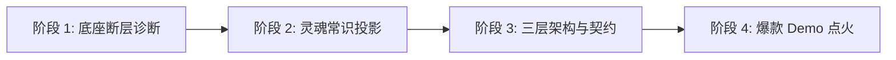

# 领域级引擎与心智模型蒸馏器 (Domain Engine Distiller)

> [!NOTE]
> 本 Skill 是一个**元架构工具（Meta-Architectural Skill）**。它将全球现象级开源框架（如 Three.js、React、Docker、PyTorch）的成功逻辑，抽象为一套通用的**“底层技术平民化”与“开发者心智垄断”工程公式**。当用户希望在任何前沿或未知领域（如 WebGPU 计算、端侧 AI、声学 DSP、3DGS、空间计算等）打造属于该领域的“Three.js”时，激活本技能。

---

## 触发条件与使用时机 (When to Use)

当面临以下诉求时应当调用本 Skill：
1. **探索新框架架构**：需要为一个复杂的底层协议/硬件（如 WebGPU/WebNN/WebCodecs/Wasm）设计优雅的应用层 SDK 或开源库。
2. **重构反人类 API**：现存工具链过于学术、底层、碎片化，需要将其重新封装为“符合人类直觉”的现代心智模型。
3. **打造现象级开源项目**：规划一个具备高传播力、极速“10秒多巴胺反馈”、并能建立开发者生态垄断的领域级引擎。
4. **技术选型与蓝图推演**：需要评估某个新技术赛道是否适合开发专属引擎，并推导其 5 大常识概念与 10 行 Hello World 语法契约。

---

## 核心心智模型：五常识投影法则 (The 5 Primitives)

任何复杂底层技术的运行拓扑，均可无损投影至人类物理世界的 **5 大常识元对象**：

$$\mathbf{World} = \mathbf{Container} + \mathbf{Driver} + \mathbf{Entity}(\mathbf{Structure} \otimes \mathbf{Property}) + \mathbf{Environment} + \mathbf{Engine}$$

| 角色 (Role) | 物理投影 | Three.js 映射 | 领域引擎通用职责 |
| :--- | :--- | :--- | :--- |
| **1. 容器 (Container)** | 宇宙空间舞台 | `Scene` (场景) | 维护对象层级树，作为所有实体与环境的全局宿主 |
| **2. 观察/驱动 (Driver)** | 观测视角与交互动力 | `Camera` (相机) | 决定视点位置、交互输入源或事件驱动调度 |
| **3. 结构体 (Structure)** | 对象的本质拓扑骨架 | `Geometry` (几何体) | 承载空间网格、张量维度、波形采样或数据拓扑 |
| **4. 属性质感 (Property)** | 对象的演化算子与质感 | `Material` (材质) | 承载着色器逻辑、物理材质、AI 人格配置或 DSP 滤镜 |
| **5. 实体合成 (Entity)** | 结构与属性的具象化单元 | `Mesh` (网格物体) | 独立可操作单元，`Entity = Structure ⊗ Property` |
| **6. 环境场 (Environment)** | 全局外部影响与规则 | `Light` (灯光) | 影响实体的外部场（光照、重力、网络噪音、安全边界） |
| **7. 管线引擎 (Engine)** | 硬件调度与输出中心 | `Renderer` (渲染器) | 消费容器拓扑，执行多线程/GPU 调度并输出最终结果 |

---

## 详细工作流 (SOP 4 阶段)



### 阶段 1：底座断层诊断 (Substrate Gap Analysis)
1. 识别底层技术的 **3 大地狱脏活**：状态机顺序依赖、内存/显存手动管理、复杂数学/硬件调度。
2. 设定**痛点消除目标**：将原生 200 行以上的繁琐配置，压缩至 10 行以内（消除倍率 $\ge 20\times$）。
3. 检查范式红利窗口，确保底层技术处于爆发前夕（如标准刚落地但工具链空缺）。

### 阶段 2：灵魂常识投影 (Mental Model Distillation)
1. 将目标领域的概念映射填入 **5 大常识卡槽**（容器、驱动、结构体、属性质感、管线引擎）。
2. **严禁生造学术黑话**：概念名称必须让普通初学者在 5 秒内猜出用途。
3. 保持实体与材质解耦，支持运行期热替换。

### 阶段 3：三层架构与 10 行极简契约 (Layering & Contract)
1. **Layer 1 (常识声明层)**：提供开箱即用默认预设，5 分钟上手。
2. **Layer 2 (组装流转层)**：支持自定义管线节点与多实体组合。
3. **Layer 3 (专家逃生舱)**：提供 `getNativeHandle()` 与 `CustomOperator`，直通底层原生对象（详见 [`references/escape_hatch_patterns.md`](references/escape_hatch_patterns.md)）。
4. 编写标准 10 行 Hello World 伪代码。

### 阶段 4：爆款 Demo 点火矩阵 (Showcase Ignition)
1. **Level 1 (5秒看懂 Demo)**：单文件、零繁琐依赖、直接在浏览器中跑通的最小奇迹。
2. **Level 2 (旗舰多巴胺 Demo)**：具备极强感官冲击力、支持实时调参的 Showcase。
3. 建立 `Examples-as-Docs` 文档体系。

---

## 辅助工具使用说明 (CLI Script Guide)

本技能附带全自动蒸馏生成脚本 `scripts/distill_engine.py`，支持一键产出完整的架构白皮书与代码契约。

### 1. 内置预设生成
```bash
# 生成 WebGPU 通用计算与流体引擎蓝图
python3 skills/domain-engine-distiller/scripts/distill_engine.py --preset webgpu -o ./output/webgpu-engine

# 生成 Web 端侧多模态 AI 智能体引擎蓝图
python3 skills/domain-engine-distiller/scripts/distill_engine.py --preset webai -o ./output/webai-engine

# 生成 Web 空间音频与 DSP 合成引擎蓝图
python3 skills/domain-engine-distiller/scripts/distill_engine.py --preset webaudio -o ./output/webaudio-engine

# 生成 3D 高斯溅射与神经实景引擎蓝图
python3 skills/domain-engine-distiller/scripts/distill_engine.py --preset splatting -o ./output/splat-engine
```

### 2. 自定义领域引擎生成
```bash
python3 skills/domain-engine-distiller/scripts/distill_engine.py \
    --name "QuantumFlow.js" \
    --domain "量子线路态矢量演化与模拟" \
    --substrate "WebAssembly SIMD + 复数张量并行计算" \
    --container "QuantumCircuit (量子线路舞台)" \
    --driver "QubitRegister (量子比特寄存器驱动)" \
    --structure "GateTopology (量子门拓扑骨架)" \
    --property "UnitaryMaterial (酉矩阵演化算子)" \
    --entity "QuantumGate (量子门操作实体)" \
    --environment "DecoherenceNoise (量子退相干环境场)" \
    --engine "StateVectorEngine (态矢量并行演化引擎)" \
    -o ./output/quantum-engine
```

---

## 红线与禁忌 (Guardrails & Anti-Patterns)

1. **绝对禁止过早开发重型 GUI 编辑器**：初创阶段必须专注于纯净、高内聚的“代码画笔”，过早制作可视化编辑器必导致维护崩溃。
2. **绝对禁止黑盒私有化（破坏逃生舱）**：严禁隐藏底层 Handle，必须允许 1% 极客注入自定义 Shader、原生 Buffer 或底层驱动。
3. **绝对禁止伪代码与未经验证的脚本**：所有产出的辅助脚本必须经过物理执行测试并包含详尽中文注释。
4. **绝对脱敏（Zero-Leakage & De-hardcoding）**：禁止硬编码任何开发机器绝对个人路径（统一使用相对路径 `./` 或环境变量）。

---

## 深入参考文档 (References)

- [通用公式与数学模型规范](references/formula_specification.md) —— 框架统治力方程与量化指标。
- [前沿领域落地案例集](references/case_studies.md) —— WebGPU、端侧 AI、空间音频、3DGS 的全套推导蓝图。
- [逃生舱与洋葱分层架构设计模式](references/escape_hatch_patterns.md) —— L0/L1/L2 接口模式与 GC 优化准则。
