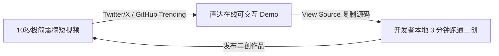

# 开发者布道、增长与 GTM 战役指南 (Developer Evangelism & GTM Playbook)

> 本指南说明如何将一个优秀的领域引擎，通过视觉冲击、案例驱动与社区自增殖飞轮，引爆全球开发者生态。

---

## 1. 核心增长飞轮：视觉多巴胺循环 (The Viral Loop)

---

## 2. 案例驱动型文档体系 (Examples-as-Docs)

现代开发者对翻阅长篇 API 参数文档极其反感，最有效的文档是 **“所见即所得的案例库（Gallery）”**：
1. **分类明晰**：基础入门、材质与光影、高级算子、逃生舱演示、商业级实战。
2. **单文件可跑**：每个案例必须能独立在 CodeSandbox / StackBlitz 中一键 Fork 运行。
3. **实时调参面板**：每个 Demo 右上角标配 `lil-gui` 或 `tweakpane`，允许用户拖动滑块实时看到画面/声音/参数变化。

---

## 3. 开源发布战役 CheckList (GTM Checklist)

* [ ] **Day 0**：准备好 1 个 10 秒即见奇迹的在线 Playground 链接（无需登录，移动端/PC 自适应）。
* [ ] **Day 1**：发布一条展示效果的高清 GIF/MP4 视频，附带极简 10 行代码对比图。
* [ ] **Day 3**：在 Reddit (r/javascript, r/webdev, r/webgpu)、Hacker News、ProductHunt 提交“Show HN”。
* [ ] **Week 1**：发起社区 Plugin 赏金或最佳 Showcase 评选，迅速沉淀二次创作。
