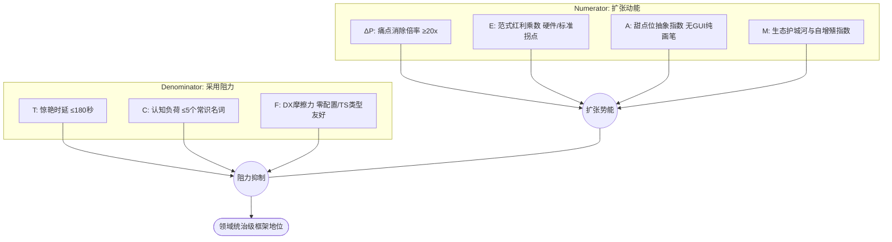

# 通用领域引擎蒸馏公式规范 (Universal Engine Master Formula Specification)

> 本规范定义了如何将任意地狱级底层技术，转化为统治级开发者生态框架的数学模型、认知工程学与反熵增体系。

---

## 1. 框架统治力动力学主方程 (The Dominance Master Equation)

在软件工程演化史中，一个开源框架能否成为领域事实标准（De Facto Standard），取决于其**认知扩张势能**与**阻力/摩擦系数**的比值：

$$\mathbf{Dominance} = \frac{\Delta \mathbf{P}_{\text{pain}} \times \mathbf{E}_{\text{paradigm}} \times \mathbf{A}_{\text{sweet-spot}} \times \mathbf{M}_{\text{moat}}}{\mathbf{T}_{\text{time-to-wow}} \times \mathbf{C}_{\text{cognitive-load}} \times \mathbf{F}_{\text{friction}}}$$



### 1.1 分子项（扩张动能）量化度量

1. **$\Delta \mathbf{P}_{\text{pain}}$（痛点消除倍率）**：
   $$\Delta \mathbf{P}_{\text{pain}} = \frac{\text{LOC}_{\text{raw}} \times \text{Complexity}_{\text{state}}}{\text{LOC}_{\text{engine}} \times \text{Complexity}_{\text{canonical}}}$$
   * 检验阈值：$\Delta \mathbf{P}_{\text{pain}} \ge 20$。例如原生 WebGL 写旋转立方体需 200 行状态机操作，Three.js 只需 10 行，倍率达 $20\times$。

2. **$\mathbf{E}_{\text{paradigm}}$（范式红利乘数）**：
   * 评估底层硬件、W3C 标准或基础设施的代际切换势能（如 Flash $\to$ WebGL，CPU $\to$ WebGPU，服务端推理 $\to$ 浏览器端侧 NPU）。处于代际红利启动期的权值取 $3.0 \sim 5.0$。

3. **$\mathbf{A}_{\text{sweet-spot}}$（甜点位抽象指数）**：
   * 衡量框架是否保持“纯净画笔”定位。不做黑盒全家桶（如强制 GUI 编辑器、强制脚手架），也不做简陋 Wrapper。保持轻量独立性时 $\mathbf{A} = 1.0$；过度臃肿时 $\mathbf{A} \to 0.1$。

4. **$\mathbf{M}_{\text{moat}}$（生态护城河与自增殖指数）**：
   $$\mathbf{M}_{\text{moat}} = \text{ExamplesCount} \times \text{PluginExtensibility} \times \text{CopyPasteIndex}$$
   * 衡量开发者是否能够一键复制代码并在 10 分钟内二次创作发布。

---

### 1.2 分母项（采用阻力）量化度量

1. **$\mathbf{T}_{\text{time-to-wow}}$（惊艳时延）**：
   * 开发者从安装/引入依赖，到在屏幕/音响上获得第一个高反馈多巴胺奇迹的时间。目标：$\le 180\text{ 秒}$。

2. **$\mathbf{C}_{\text{cognitive-load}}$（心智认知负荷）**：
   * 核心概念数量 $N \le 5$。且每个名词必须与现实世界物理常识强映射（如 `Scene`, `Camera`, `Light`, `Material`, `Mesh`）。

3. **$\mathbf{F}_{\text{friction}}$（开发者体验摩擦力）**：
   $$\mathbf{F}_{\text{friction}} = w_1 T_{\text{setup}} + w_2 N_{\text{boilerplate}} + w_3 (1 - \text{TypeScriptAutoCompleteScore})$$
   * 零构建运行时引入（CDN 标签即跑）时 $\mathbf{F} \to 1.0$；需要繁琐环境配置或复杂编译链时 $\mathbf{F} \ge 10.0$。

---

## 2. 五常识投影法则 (The Universal 5 Primitives Matrix)

任何复杂系统的底层运算与交互，均可无损同构投影为 5 大常识元对象：

$$\mathbf{World} = \mathbf{Container} + \mathbf{Driver} + \mathbf{Entity}(\mathbf{Structure} \otimes \mathbf{Property}) + \mathbf{Environment} + \mathbf{Engine}$$

```
┌────────────────────────────────────────────────────────────────────────┐
│  Container (宇宙容器舞台)                                               │
│    ├── Driver / Observer (观察视角与交互动力)                           │
│    ├── Environment (外部全局场与世界规则)                                │
│    └── Entity (具象化可操作个体)                                         │
│          ├── Structure (骨架数据与几何拓扑)                               │
│          └── Property (演化材质与行为算子)                              │
└──────────────────────────────────┬─────────────────────────────────────┘
                                   ▼
         Engine (硬件调度与多核输出管线引擎)
```

### 2.1 五大元对象的设计公理

1. **容器独立性公理 (Container Independence)**：
   `Container` 仅维护对象拓扑树与生命周期事件，不直接包含特定硬件的绘制/调度逻辑，确保可跨平台无损迁移。
2. **实体解耦公理 (Entity Decoupling)**：
   实体是结构（拓扑）与属性（算子/材质）的笛卡尔直积：
   $$\text{Entity} = \text{Structure} \otimes \text{Property}$$
   允许在运行期任意无损热替换 `Property`（如动态切换 Shader/材质）或变换 `Structure`。
3. **管线纯粹性公理 (Pipeline Purity)**：
   `Engine.run(Container)` 负责数据吞吐与硬件交互，保证单向数据流与可暂停、可回放、可单步调试性。

---

## 3. 反框架熵增与抗腐化定律 (Anti-Framework Entropy Law)

历史上绝大多数优秀框架之所以走向衰落，均因违反了以下三大定律：

```
┌─────────────────────────────────────────────────────────────────────────┐
│                           反框架熵增防御三原则                             │
├────────────────────────────────┬────────────────────────────────────────┤
│ 1. 拒绝 GUI 编辑器捆绑           │ 核心库永远只做高内聚的“代码画笔”         │
│ 2. 保持逃生舱 100% 畅通         │ 允许专家直接注入底层 Handle/Shader/Buffer│
│ 3. 运行主循环零内存垃圾 (Zero-GC)│ 严禁在 60fps 热循环中 new 对象与动态闭包 │
└────────────────────────────────┴────────────────────────────────────────┘
```

1. **抗全家桶腐化 (Anti-Bloatware Rule)**：
   切勿过早开发 Web 可视化编辑器。一旦核心库与编辑器深度绑定，维护成本将呈指数级爆炸，失去作为纯净基础设施的通用性。
2. **逃生舱完备性 (Escape Hatch Completeness)**：
   封装必须是“多孔的（Porous Abstraction）”。通过 `getNativeHandle()` 与 `CustomOperator`，让 1% 的顶级专家始终拥有打破封装直达底层的能力。
3. **零内存分配准则 (Zero-GC in Hot Loop)**：
   在任何实时计算、渲染或音频主循环中，内存分配量必须恒等于零（$\Delta \text{Heap} = 0$）。所有向量运算与中间状态全部使用对象池化与预分配 TypedArray。
