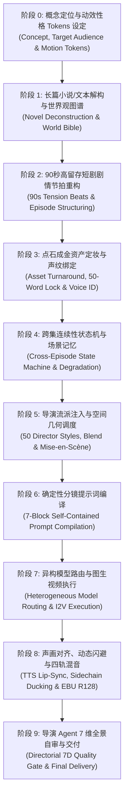

# 工业级 AI 视频创作十阶标准作业程序 (SOP)

> 本文档定义了从 **完整长篇小说 / 原始剧本 / 创意 Brief** 到 **80~100 集爆款短剧 / 季番动态漫 / 电影级视频** 的十阶工业化全生命周期标准作业程序。

---

## 🗺️ 十阶全生命周期管线全景图

---

## 📋 各阶段执行标准与验收门禁

### 阶段 0：概念定位与动效性格 Tokens (Concept & Motion Tokens)
*   **目标**：确立影片画幅（竖屏 9:16 / 横屏 16:9 / 电影 2.35:1）、发行渠道、目标受众与动效调性。
*   **动效性格 Tokens**：
    *   *专业商务/科技*：时长 ~21f，`cubic-bezier(0, 0, 0.2, 1)`，运镜克制，零弹性。
    *   *东方仙侠/玄幻*：快慢节奏交替（Sakuga timing），水墨/气劲粒子拖尾，高能冲击。
    *   *爆款短剧/动态漫*：0-3s 强钩子，高对比色板，紧凑对白，居中黄金焦点。
*   **交付物**：《项目概念与执行约束表》。

---

### 阶段 1：长篇文本解构与原著真值锁定 (World Bible & Canonical Locking)
*   **目标**：针对输入的长篇小说（数十万至数百万字），进行层次化提取、实体建模，并建立**原著真值矩阵 (Canonical Truth Matrix)**。
*   **忠实原著铁律**：默认 100% 遵循原著，未经显式二创授权，严禁擅自篡改人设性格、胜负因果、战力规则与经典名场面。
*   **关键执行步骤**：
    1.  **世界观与力量体系**：建立力量等级（如炼气/筑基/金丹）与对应破坏半径、视觉特效尺寸，严禁跨境界失真。
    2.  **人物关系与性格真值**：提取核心人物事实（动机/缺陷/处事风格），确立不可动摇的人设底线，合并无独立因果线的背景龙套。
    3.  **原著真值对账清单**：固化核心伏笔道具链、关键事件因果树与标志性名场面金句。
    4.  **大事件主线树**：将小说划分为 5~8 个重大叙事大卷（Story Arcs）。
*   **交付物**：包含 `canonical_truth_matrix` 的 `novel_breakdown_template.json`。

---

### 阶段 2：90 秒高留存剧情节拍重构 (90s Tension Beats)
*   **目标**：将小说章节压缩改编为标准化 90 秒短剧分集剧本（1 章网文 ~2000 字 ➔ 1 集短剧 300-500 字）。
*   **90 秒五拍节拍器标准**：
    *   `00:00 - 00:03 【第 1 拍 · 生死钩 (Hook)】`：危机前置，开场呈现上一集悬念爆发或核心冲突。
    *   `00:03 - 00:25 【第 2 拍 · 冲突蓄压 (Tension)】`：反派施压、身份信息差拉满、主角隐忍积蓄势能。
    *   `00:25 - 00:65 【第 3 拍 · 爽点反转 (Payoff)】`：底牌掀开、招式破局、神级特效释放、地位逆转。
    *   `00:65 - 00:80 【第 4 拍 · 情绪余韵 (Rest)】`：保留 ≥1.0s 呼吸位，呈现配角震撼反应。
    *   `00:80 - 00:90 【第 5 拍 · 悬崖断点 (Cliffhanger)】`：突发未知变故或强敌降临，强制诱导下一集。
*   **交付物**：《分集 90s 剧本与节拍表》。

---

### 阶段 3：点石成金资产定妆与声纹绑定 (Asset Staging)
*   **目标**：锁定全局视觉与听觉资产，杜绝角色漂移与声音割裂。
*   **三大锁定规范**：
    1.  **角色三视图卡**：正面全身（去头）+ 背面全身 + 高清脸部特写（中性灰底、平光、无滤镜真实毛孔）。
    2.  **50 字不可变外貌锁 (Fixed Prompt)**：精炼角色的固定五官、发型、服装特征，逐镜头字句不改注入。
    3.  **声纹 Voice ID 绑定**：为主配角分配固定 Voice ID，保证全剧 100 集中音色绝对一致。
*   **交付物**：《角色/场景/道具资产字典》与《Voice ID 矩阵》。

---

### 阶段 4：跨集连续性状态机 (Continuity State Machine)
*   **目标**：管理跨集角色状态变化、道具持有者转移与场景破坏累积。
*   **状态追踪规则**：
    *   *角色状态*：跟踪当前生命值、受伤破损（如“左脸血痕”）、服装版本（如“战损黑袍”）。
    *   *场景记忆*：上一集打碎的盘龙柱与地面坑洞，在后续镜头中必须持续存在，严禁自动复原。
*   **交付物**：《连续性状态机元数据表》。

---

### 阶段 5：导演流派注入与空间几何调度 (Directorial Blocking)
*   **目标**：将剧本动作转化为具有大师级电影质感的视听画面调度。
*   **调度法则**：
    *   *流派调用*：调用 7 大系 50 种影史导演美学（如杜琪峰几何三角、徐克新武侠、王家卫抽帧）。
    *   *180 度轴线守卫*：确定摄影机始终位于角色动作连线的一侧，严禁无故越轴导致方向混乱。
    *   *空间地标绑定*：每个场景绑定单一长期不变地标（如圆柱、长明灯、破损祭坛）。
*   **交付物**：《导演视听调度设计表》。

---

### 阶段 6：确定性分镜提示词编译 (Cinematic Prompt Compilation)
*   **目标**：将分镜动作编译为符合 AI 视频模型理解习惯的工业级提示词。
*   **核心编译原则**：
    *   *单镜自包含*：绝不假设模型记得前文，单镜头包含全量画质、角色、光影、运镜与动作信息。
    *   *七段式公式*：【画质风格】+【角色外貌锁】+【场景光学】+【摄影焦段】+【动作受力】+【声画对位】+【负向约束】。
    *   *运镜动作同句融合*：运用分号同步式、镜头先行式、被动震颤式等 5 大句式。
    *   *工程参数脱敏*：将 `f/2.8`、`5m/s` 等参数转化为物理感知描述（如浅景深圆形散景、放射状动态模糊）。
*   **交付物**：《完全自包含逐镜提示词列表》。

---

### 阶段 7：异构模型路由与生片执行 (Model Routing & I2V)
*   **目标**：依据镜头视听特征，智能分发至最擅长的 SOTA 视频生成模型。
*   **路由规则**：
    *   *大破坏/物理流体/超写实* ➔ **Kling 3.0 / Wan 2.6**。
    *   *多角色武打/高难度运镜/参考图绑定* ➔ **Seedance 2.5 / 2.0**。
    *   *超长时空穿梭/大场景奇观* ➔ **Google Veo 3.1 / Sora 2**。
    *   *原生音画对白/短剧正反打* ➔ **Hailuo 2.3**。
*   **生片铁律**：坚守 **I2V (图生视频)** 模式，以高清定妆图作为首帧驱动，严禁纯文本盲抽。

---

### 阶段 8：声画对齐与四轨混音工程 (Audio-Visual & Stem Mixing)
*   **目标**：消除声音割裂感，实现电影级四轨平衡混音。
*   **混音标准**：
    *   *四轨架构*：A1 对白轨 + A2 旁白 OS 轨 + A3 配乐 BGM 轨 + A4 音效 SFX 轨。
    *   *动态闪避 (Sidechain)*：对白出现时 BGM 自动下压 8~12dB，对白结束 0.4s 内平滑回升。
    *   *原生音轨治理*：A1 专业配音生效时，视频模型自带原生杂音衰减至 -18dB 或静音。
    *   *响度归一化*：全片必须符合 **EBU R128 标准 (-16.0 LUFS ~ -14.0 LUFS，True Peak ≤ -1.0 dBTP)**。
*   **交付物**：《四轨混音工程配置与母带音频》。

---

### 阶段 9：导演 Agent 7 维全景自审与终验 (Directorial Quality Gate)
*   **目标**：在交付前模拟苛刻观众与资深制片人，执行 7 大维度自动化体检。
*   **7 大体检维度**：
    1.  *空间可读性*：180 度轴线是否守卫？敌我朝向是否明确？
    2.  *运镜舒适度*：机位运动是否有物理依托？是否存在无意义画面乱晃？
    3.  *动作力学直觉*：发力是否有前摇？碰撞是否有接触形变与破坏位移？
    4.  *FACS 表演微表情*：面部是否生动？是否有眼神生命与呼吸起伏？
    5.  *黄金 3s 节奏留存*：开场是否有强钩子？全片是否有无意义拖沓？
    6.  *视觉一致性*：跨镜头角色人脸、服装、道具是否发生漂移？
    7.  *声画对位*：台词口型是否对齐？BGM 是否压制人声？
*   **交付物**：`director_audit_report_template.md` 与最终合格交付母片。
