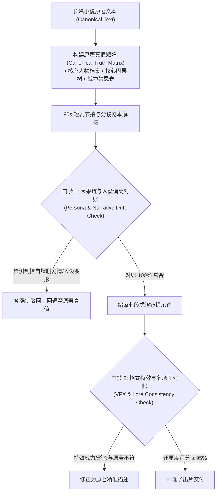

# 原著真值忠实度与严防无授权魔改准则手册 (Canonical Fidelity & Anti-Distortion Manual)

> **工业最高铁律**：在处理长篇小说、成熟故事、经典 IP 及既有剧本时，系统的**第一根本准则是「原著真值至上 (Canonical Ground Truth First)」**。
> 除非用户在 Prompt 中显式提出二创/重构要求（如“*进行搞笑同人改编*”、“*将反派重塑为悲剧英雄*”），否则**默认全流程 100% 遵循原著，严禁篡改内容、人设、剧情、因果走向、战力法则与经典名场面**。

---

## 🏛️ 一、四大不可动摇的原著真值锚点 (The Four Canonical Anchors)

```
┌────────────────────────────────────────────────────────────────────────────────────────┐
│                        四大原著真值锁定系统 (Canonical Anchors)                        │
├────┬─────────────────────────────┬────────────────────────────────────────────────────┤
│ A1 │ 人设性格与道德基准真值      │ 严禁弱化主角核心执念，严禁违背角色既有道德观与语气 │
├────┼─────────────────────────────┼────────────────────────────────────────────────────┤
│ A2 │ 剧情因果链与重大事件树      │ 严禁颠倒胜负结局，严禁擅自增删生死、离别与觉醒节点 │
├────┼─────────────────────────────┼────────────────────────────────────────────────────┤
│ A3 │ 世界观法则与战力天花板      │ 严格遵循原著境界与功法克制，严禁低阶无逻辑越级碾压 │
├────┼─────────────────────────────┼────────────────────────────────────────────────────┤
│ A4 │ 经典名场面与标志性金句      │ 核心标志台词逐字保留，标志性终结动作与分镜帧级还原 │
└────┴─────────────────────────────┴────────────────────────────────────────────────────┘
```

### 1. 人设性格与道德基准真值 (Persona & Moral Anchor)
*   **杀伐与处事风格锚定**：
    *   若原著主角以“杀伐果断、谨慎内敛、利己自保”（如凡人流、极道流）著称，改编中**绝不能弱化为圣母心泛滥、优柔寡断或见色起意**。
    *   若反派在原著中是纯粹的利益博弈者或傲慢狂妄之徒，**严禁无端强行洗白或强加狗血爱情苦衷**。
*   **语气与对话 DNA 锚定**：
    *   角色的说话习惯（古风文言、市井痞气、冷酷言简意赅、学究引经据典）必须 100% 保留，不可被 AI 通用大白话抹平。

### 2. 剧情因果链与重大事件树 (Narrative & Causality Anchor)
*   **因果必然性**：
    *   主角之所以获得某件法宝、突破境界或遭遇追杀，必须严格沿用原著的触发原因，**绝不能无端凭空掉落机缘或凭空招惹无逻辑仇恨**。
*   **伏笔与次要道具保护**：
    *   原著中前期出现的微小信物、破损古玉、神秘残卷等，往往是中后期破局的关键因果线索，**解构时严禁作为“无关背景物”随意删除**。

### 3. 世界观法则与战力天花板 (Worldbuilding & Power Rules Anchor)
*   **境界压制不可逆**：
    *   原著中凡人与修士、低阶与高阶之间的战力天堑必须严格体现。若原著强调“金丹之下皆为蝼蚁”，分镜中绝不可出现练气期弟子肉拳击飞金丹修士的荒谬画面。
*   **法术异能物理形态精准还原**：
    *   原著若描述为“三尺青峰，无声无息”，绝不能改写为“百米雷火漫天轰炸”；原著若为“暗夜潜行刺杀”，绝不能改写为“正面开无双对轰”。

### 4. 经典名场面与标志性金句 (Iconic Scenes & Quotes Anchor)
*   原著中具有读者共识的灵魂台词（如“三十年河东，三十年河西”、“天不生我李淳罡，剑道万古如长夜”、“手握日月摘星辰”）必须在对应高潮帧中作为**核心 A1 音轨与特写画面完整呈现，一字不改**。

---

## ⚖️ 二、「合规视听转化」与「违规恶意魔改」权威对照表

影视化改编需要将文学语言转化为画面语言，但**视听转化绝非魔改**。以下是工业级改编的边界红线：

| 小说原生形态 | ✅ 合规的忠实视听转化 (Allowed Externalization) | ❌ 违规的恶意魔改 (Forbidden Distortion) |
| :--- | :--- | :--- |
| **千字心理活动与内心算计** | 转化为下颌咬肌收紧、眼眸微眯、指节发力等 FACS 动作，配合 1 句简短内心独白 OS。 | 擅自让内敛深沉的主角把全盘计划和底牌大声向敌人自曝出来。 |
| **冗长的大段学术/背景旁白** | 转化为 2~3 秒极具信息量的环境全景镜头，或由配角在具体行动中自然带出。 | 擅自捏造一个原著不存在的“万能讲解老爷爷”角色从头解说到尾。 |
| **数十人混战的无名侍卫** | 作为背景群演呈现站位与被气浪掀飞的物理受力，聚焦核心对手对决。 | 擅自提拔无名侍卫为主演，为其编造多角恋爱与原创生死背叛戏。 |
| **数十回合重复打斗描写** | 提炼为“试探 ➔ 变招 ➔ 破防 ➔ 终结”的六步闭环，招式名称与属性完全符合原著。 | 擅自替换主角修炼的标志性功法，让剑修凭空搓出火球术。 |
| **数千字文戏争吵** | 提炼核心利益冲突，保留原著标志性台词，按 3~4 字/秒精简为紧凑影视交锋。 | 彻底篡改双方谈判筹码与妥协结果，颠倒原著剧情走向。 |

---

## 🛡️ 三、工业级防魔改双向对账机制 (The Canonical Audit Gate)



### 1. 原著真值矩阵前置固化 (Canonical Truth Matrix)
在解构小说第 1 步，必须输出包含以下字段的真值结构：
```json
{
  "canonical_truth_matrix": {
    "source_chapter_range": "第 1 章 - 第 3 章",
    "unalterable_core_facts": [
      "林风灵根被夺，目前修为仅存炼气一层",
      "顾少炎持有顾家主母手谕前来逼迫退婚",
      "林风底牌为体内沉睡的混沌剑胚，绝不能提前暴露给外人"
    ],
    "forbidden_distortions": [
      "严禁让林风对顾少炎下跪求饶",
      "严禁让顾少炎在此时洗白倒戈",
      "严禁在未拔出混沌断剑前使用高阶剑阵"
    ]
  }
}
```

### 2. 用户显式二创授权协议 (Explicit Creative Override)
*   **默认状态**：`canonical_strict = True`。所有生成结果必须严格受《原著真值矩阵》约束。
*   **解除约束条件**：仅当用户指令包含明确的变更声明（如 `“请基于原著进行同人魔改，让反派成为主角的卧底好友”`）时，系统才将对应角色/情节标记为 `override_allowed = True`，并在生成报告中显式列出二创变更项。
