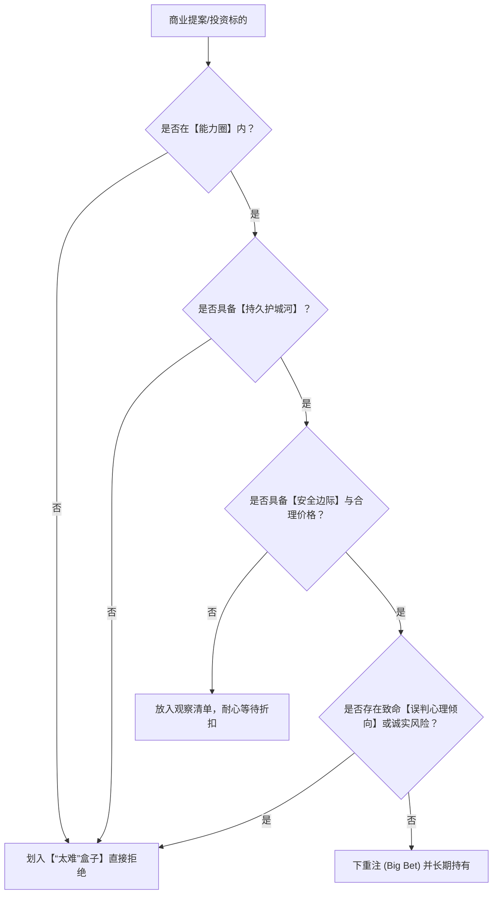

# 05-decisions.md · topic-munger-mental-models 角色深度考据档案

> 本档案深度拆解查理·芒格（Charlie Munger）一生中的重大商业决策、投资项目案例、决策逻辑链条与避错案例。

---

## 一、 经典投资决策案例拆解

### 1. 【喜诗糖果 (See's Candies) —— 从烟蒂股到品质投资的转折点】
* **决策时间**：1972年。
* **交易细节**：以2500万美元收购，当时净资产仅约800万美元，溢价显著。
* **芒格的决策模型**：
  1. **【品牌护城河 (Brand Moat)】**：在加州，喜诗糖果代表着节日问候与诚意，消费者对价格极不敏感。
  2. **【定价权 (Pricing Power)】**：喜诗每年圣诞节都可以顺利提价而销量不减。
  3. **【轻资产与自由现金流】**：不需要大量资本二次投入（无需大量新工厂或复杂研发），产生的现金流可用于投资其他高回报项目。
* **投资结果**：为伯克希尔贡献了超过20亿美元的累计利润，彻底重塑了巴菲特与伯克希尔的投资范式。

### 2. 【比亚迪 (BYD) —— 识别天才与产业趋势】
* **决策时间**：2008年。
* **交易细节**：伯克希尔以2.3亿美元入股比亚迪，持有约10%股份。
* **芒格的决策模型**：
  1. **【企业家品质模型】**：王传福具备极强的工程师底色与狂热的专注度。
  2. **【工程与规模优势】**：在电池制造与垂直整合供应链上具备极强的成本优势。
  3. **【演化趋势】**：预判电动汽车与清洁能源将替代传统燃油车。
* **投资结果**：伯克希尔获得数十倍投资回报，并在十余年后平稳套现收回数十亿现金。

### 3. 【可口可乐 (Coca-Cola) —— 心理学与全球分销网络的叠加】
* **决策时间**：1988年前后。
* **芒格的决策模型**：
  1. **【巴甫洛夫联想条件反射】**：红白包装、清凉口感与快乐、运动场景绑定。
  2. **【社会认同 (Social Proof)】**：全球数十亿人的饮用习惯形成强大的社会从众效应。
  3. **【规模效应与全球分销】**：极其难以被复制的全球瓶装厂与渠道网络。

---

## 二、 拒绝与避错案例 (The "Too Hard" & Reject Decisions)

### 1. 【拒绝互联网狂热泡沫 (1999-2000 Dot-com Bubble)】
* **决策背景**：在1999年科技股狂热期，伯克希尔因一股不买无利润的互联网公司而饱受华尔街嘲讽。
* **芒格的逻辑**：“我们不理解这些没有现金流、只有点击量的科技公司五年后会怎样。这超出了我们的【能力圈 (Circle of Competence)】。既然看不懂，那就一股不买。”
* **结果**：2000-2002年科技泡沫破裂，无数基金清盘，而伯克希尔毫发无损并在低位抄底优质资产。

### 2. 【拒绝高杠杆与衍生品结构 (Financial Weapons of Mass Destruction)】
* **决策逻辑**：芒格坚决反对使用高杠杆与过度复杂的衍生品。
* **名言**：“聪明人导致破产只有三种方式：酒、女人和杠杆 (Liquor, Ladies, and Leverage)。”
* **安全边际实践**：伯克希尔长期保持数百亿至上千亿美元的账面现金储备，宁可牺牲短期收益率，也绝不在流动性危机中暴露风险。

---

## 三、 芒格决策复盘逻辑矩阵

