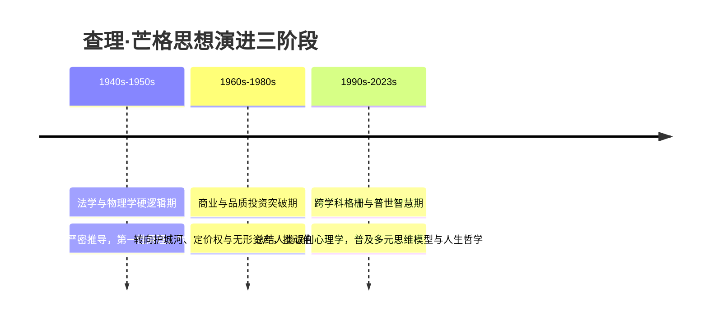

# 06-timeline.md · topic-munger-mental-models 角色深度考据档案

> 本档案详尽梳理查理·芒格（Charlie Munger, 1924-2023）生平履历、重大人生节点、思想演进与商业里程碑时间线。

---

## 一、 生平履历与思想演进年代线

| 年份 | 年龄 | 生平重大事件 | 思想演进与关键里程碑 |
| :--- | :--- | :--- | :--- |
| **1924年** | 0岁 | 1月1日出生于美国内布拉斯加州奥马哈（Omaha）。 | 父亲为当地律师，从小培养阅读与理性思考习惯。 |
| **1930年代** | 10代 | 在巴菲特祖父经营的奥马哈杂货店打工。 | 首次体验严苛的工时管理与商业纪律，但此时尚未结识巴菲特。 |
| **1941年** | 17岁 | 进入密歇根大学（University of Michigan）主修数学。 | 奠定了【概率论】、【统计学】与【数学简化模型】的思考基础。 |
| **1943年** | 19岁 | 应征入伍加入美国陆军航空兵，被派往加州理工学院（Caltech）进修气象学。 | 接受了严苛的物理学、热力学与气象预报训练，掌握【第一性原理】与预报避错逻辑。 |
| **1948年** | 24岁 | 未取得学士学位的情况下，凭优异表现破格考入并以荣誉成绩毕业于哈佛法学院（Harvard Law School）。 | 建立法学推理、严密论证与【检查清单 (Checklist)】式的避错逻辑。 |
| **1962年** | 38岁 | 与合伙人共同创办知名律所 Munger, Tolles & Olson，同时创立 Wheeler, Munger & Company 投资公司。 | 1962-1975年间，投资公司年化收益率达19.8%，远超标普500指数。 |
| **1959年** | 35岁 | 父亲去世返回奥马哈，在一次晚餐聚会上首次结识沃伦·巴菲特（Warren Buffett）。 | 两人一见如故，开启了商业史上最伟大的半个多世纪的终身搭档与友谊。 |
| **1972年** | 48岁 | 主导推动收购喜诗糖果 (See's Candies)。 | 促成了巴菲特与伯克希尔从“烟蒂股”向【品质投资 (Quality Investing)】的根本范式转变。 |
| **1978年** | 54岁 | 出任伯克希尔·哈撒韦公司董事会副主席（Vice Chairman）。 | 协助巴菲特将伯克希尔打造为涵盖保险、铁路、能源、零售与制造的巨型多元化控股集团。 |
| **1984-2011年** | 60-87岁 | 担任威斯科金融公司（Wesco Financial）董事长兼CEO。 | 将威斯科作为个人独立的投资与管理实验田，主导极度稳健的资产运营。 |
| **1995年** | 71岁 | 在哈佛大学发表经典演讲《人类误判心理学》。 | 系统性总结【25种人类误判心理倾向】，将行为心理学与商业决策深度融合。 |
| **2005年** | 81岁 | 彼得·考夫曼主编的《穷查理宝典》(Poor Charlie's Almanack) 正式出版。 | 芒格的【多元思维模型格栅】与【普世智慧】在全球范围内引发巨大轰动。 |
| **2008年** | 84岁 | 在李录推荐下重仓投资比亚迪 (BYD)。 | 展现了高龄依然保持敏锐学习能力与对新兴技术/产业趋势的把握。 |
| **2009-2023年**| 85-99岁 | 每年独自主持 Daily Journal 股东大会。 | 成为全球投资者探寻理性、投资与人生智慧的精神导师。 |
| **2023年** | 99岁 | 11月28日于加利福尼亚州圣巴巴拉的一家医院平静离世，享年99岁。 | 巴菲特声明：“没有查理的灵感、智慧和参与，伯克希尔绝不可能发展到今天的地位。” |

---

## 二、 芒格人生思想的三二次跃迁

