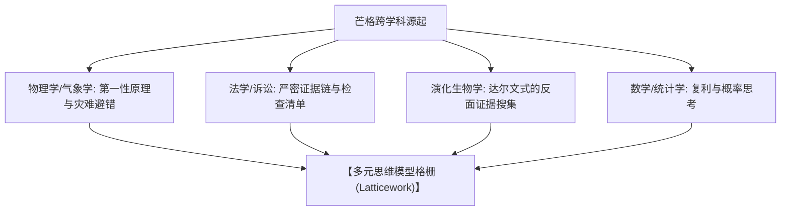

# series_01_origin.md · topic-munger-mental-models 角色深度考据档案

> 本档案深度考据查理·芒格思想的源起，重点解析其法学训练、物理学气象学逻辑与跨学科阅读体系如何孕育出【多元思维模型格栅】。

---

## 一、 思想萌芽：数学与气象学的硬科学训练

### 1. 【密歇根大学数学训练】
* **核心积累**：芒格早期对数学的系统学习，使其养成了用抽象逻辑与数量关系看问题的习惯。
* **思维烙印**：任何商业命题如果不能用【基本算术】、【排列组合】与【复利公式】进行定量拟合，就容易沦为虚无的空谈。

### 2. 【加州理工学院气象学训练】
* **二战背景**：在陆军航空兵服役期间，芒格在加州理工学院接受气象学家培训，绘制天气图并预测飞行气象。
* **避错逻辑**：气象预测是典型的【非线性复杂系统】。芒格意识到：“我的预报关乎飞行员的生死。如果我忽视了一个微小冷锋与热气流的交汇，飞机就会坠毁。这迫使我学会预先设想最糟糕的气象灾难（逆向思考）。”

---

## 二、 律所实战：法学推理与检查清单 (Checklist)

### 1. 【哈佛法学院与律所生涯】
* **法学思维**：强调证据链的严密性、事实界定与反方抗辩（Audi alteram partem）。
* **对商业的启发**：在商业合同与诉讼中，芒格看到了无数因为条款漏洞、道德风险与盲目乐观导致的商业破产。这直接促成了其【检查清单 (Checklist Method)】机制的形成。

---

## 三、 跨学科阅读体系与知识无边界

### 1. 【“长着双腿的书架”】
* **阅读习惯**：芒格每天花数小时阅读历史、传记、科学、心理学与经济学书籍。巴菲特曾调侃：“查理如果不看书，他就睡不着觉；如果他手里没有书，他就感觉自己裸体。”

### 2. 【经典跨学科书单与思想汲取】
* **物理学与化学**：汲取【第一性原理】、【临界质量 (Critical Mass)】、【催化剂 (Catalyst)】与【热力学熵增】。
* **演化生物学**：阅读达尔文（Charles Darwin），汲取【生态位 (Ecological Niche)】、【自然选择】与【适应性演化】。达尔文对反面证据的极度敏锐（只要发现与自己理论不符的事实，立即记录并反思）成为芒格最推崇的心理习惯。
* **心理学**：阅读西奥迪尼（Robert Cialdini）《影响力》，系统整合人类行为偏差。

