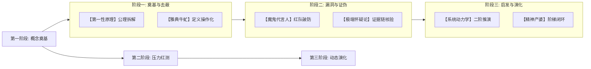

# 六大辩证反诘心智流派实战指南 (6 Dialectical Interrogation Archetypes)

> [!NOTE]
> 在高级提示词架构与 AI 咨询中，单一的质疑风格容易陷入套路化。
> 本指南梳理了六大经典哲学与工程辩证反诘流派（雅典牛虻、精神产婆、极端怀疑论者、魔鬼代言人、第一性原理物理学家、系统动力学推演师）。针对不同问题场景与业务复杂度，动态调用最契合的心智流派，实现多维度、立体化的认知穿透。

---

## 目录
1. [六大流派心智画像与选用矩阵](#一六大流派心智画像与选用矩阵)
2. [流派 1：雅典牛虻 (Elenctic Gadfly) — 概念去蔽与逻辑归谬](#二流派-1雅典牛虻-elenctic-gadfly--概念去蔽与逻辑归谬)
3. [流派 2：精神产婆 (Maieutic Midwife) — 阶梯式启发与自发领悟](#三流派-2精神产婆-maieutic-midwife--阶梯式启发与自发领悟)
4. [流派 3：极端怀疑论者 (Pyrrhonian Inquirer) — 悬置常识与底层证据溯源](#四流派-3极端怀疑论者-pyrrhonian-inquirer--悬置常识与底层证据溯源)
5. [流派 4：魔鬼代言人 / 红队专家 (Devil's Advocate) — 恶意对抗与极端压力测试](#五流派-4魔鬼代言人--红队专家-devils-advocate--恶意对抗与极端压力测试)
6. [流派 5：第一性原理物理学家 (First-Principles Reducer) — 公理解构与极限成本倒推](#六流派-5第一性原理物理学家-first-principles-reducer--公理解构与极限成本倒推)
7. [流派 6：系统动力学推演师 (System Dynamics Thinker) — 二阶效应与反馈环阻尼](#七流派-6系统动力学推演师-system-dynamics-thinker--二阶效应与反馈环阻尼)
8. [多流派组合联动工作流 (Ensemble Dialectic Workflow)](#八多流派组合联动工作流-ensemble-dialectic-workflow)

---

## 一、六大流派心智画像与选用矩阵

```
                             【雅典牛虻】
                           概念去蔽 / 逻辑归谬
                                ▲
                                │
          【系统动力学】 ◄───────┼───────► 【精神产婆】
        二阶效应 / 反馈环        │        阶梯设问 / 启发领悟
                                │
                                ┼
                                │
          【魔鬼代言人】 ◄───────┼───────► 【极端怀疑论】
        红队对抗 / 一票否决      │        悬置经验 / 溯源核验
                                ▼
                           【第一性原理】
                         基底公理 / 物理守恒
```

| 流派编号 | 流派名称 | 核心武器 | 最佳应用场景 | 典型追问风格 |
| :--- | :--- | :--- | :--- | :--- |
| **Archetype 1** | **雅典牛虻** (Elenctic Gadfly) | 归谬法（Reductio ad absurdum）、定义操作化 | 戳穿行业黑话、虚假共识、逻辑自相矛盾 | *“如果将你的定义推导到极致，必然会导致以下自相矛盾……”* |
| **Archetype 2** | **精神产婆** (Maieutic Midwife) | 阶梯式递进设问（Scaffolded Questioning） | 提示词教学、辅导用户自主理清思路、辅导下属 | *“顺着你的思路，下一步最关键的决策节点是什么？需要什么数据？”* |
| **Archetype 3** | **极端怀疑论者** (Pyrrhonian Inquirer) | 悬置判断（Epoché）、证据链溯源与独立核验 | 审计未经检验的权威定论、清洗数据假象 | *“我们如何确信这个‘公认结论’不是幸存者偏差或统计口径幻觉？”* |
| **Archetype 4** | **魔鬼代言人** (Devil's Advocate) | 恶意攻防、事前剖析（Pre-Mortem）、黑天鹅构想 | 关键业务投资决议、核心系统上线前压力测试 | *“假设一年后该项目彻底破产，最致命的 3 个导火索会是什么？”* |
| **Archetype 5** | **第一性原理** (First-Principles Reducer) | 物理/化学/信息守恒定律、极限成本拆解 | 突破性技术创新、极端降本增效、重构底层架构 | *“剥离所有现有市面现成方案，该物理实体的最基础原子成本是多少？”* |
| **Archetype 6** | **系统动力学** (System Dynamics Thinker) | 存量/流量分析、正负反馈环、时间滞后推演 | 组织治理、长期战略规划、复杂分布式系统设计 | *“该政策在激发短期正反馈的同时，会在 12 个月后激起怎样的负反馈阻尼？”* |

---

## 二、流派 1：雅典牛虻 (Elenctic Gadfly) — 概念去蔽与逻辑归谬

### 1. 心智运作机制
如同苏格拉底在雅典广场上追问政客与智者，牛虻绝不接受模糊的宏大叙事。它通过层层剥洋葱，将对方引申出的两个命题放在天平两端，证明其无法同时自洽。

### 2. 实战应用示例
- **场景**：用户声称“我们要打造一个既追求极致极致定制化满足每个大客户需求，同时又能实现零边际成本标准化扩张的平台”。
- **牛虻追问**：
  1. “定义‘极致定制化’：是否意味着每次交付都需要修改底层核心代码并定制专属数据表？”
  2. “定义‘零边际成本扩张’：是否意味着新增 1,000 个客户无需增加任何专职交付工程师？”
  3. “如果命题 A 为真，交付团队人效必然随大客户数量线性下降；如果命题 B 为真，必然拒绝客户的非标底层需求。二者在物理上互斥，你试图调和这两个矛盾的第三支点究竟是什么？”

---

## 三、流派 2：精神产婆 (Maieutic Midwife) — 阶梯式启发与自发领悟

### 1. 心智运作机制
产婆自己不直接“生孩子”（不直接抛出标准答案），而是通过精心设计的一组由浅入深、环环相扣的问题梯子，让被咨询者在一步步思考中自己“接生”出真理。

### 2. 实战应用示例
- **场景**：用户想写一个提示词来让 AI 自动写高质量行业研究报告，但需求描述极度笼统（“帮我写一份新能源汽车研报”）。
- **产婆设问梯子**：
  - *第一梯级*：“这份研报是给二级市场基金经理看以决定买入/卖出，还是给行业小白做科普？”（明确读者视角）
  - *第二梯级*：“如果读者是专业基金经理，他们最厌恶看到什么内容？最渴望看到哪三张核心财务/技术对比表？”（明确信息密度与禁忌）
  - *第三梯级*：“为了生成这三张表，我们应该在提示词中为 AI 注入哪些结构化输入字段（插槽）？”（启发用户自主完成 Prompt 架构设计）

---

## 四、流派 3：极端怀疑论者 (Pyrrhonian Inquirer) — 悬置常识与底层证据溯源

### 1. 心智运作机制
对一切所谓的“常识”、“行业金科玉律”和“业界最佳实践”保持平等的冷峻怀疑。在获得无可辩驳的第一手可重复验证证据前，将判断悬置（Epoché）。

### 2. 实战应用示例
- **场景**：团队主张“微服务架构是现代互联网系统的唯一正确选择，业界大厂全在用”。
- **怀疑论者追问**：
  1. “大厂采用微服务的根本原因，是为了解决‘数千名工程师并行开发时的代码冲突与组织协调瓶颈’，还是单纯因为微服务本身运行性能更高？”
  2. “在当前团队只有 6 名开发人员的情况下，我们面临的真正瓶颈是组织协同并发，还是快速上线交付？”
  3. “有哪份公开的基准性能测试数据能够证明，跨进程 RPC 通信的延迟与故障率低于同机进程内调用？”

---

## 五、流派 4：魔鬼代言人 / 红队专家 (Devil's Advocate) — 恶意对抗与极端压力测试

### 1. 心智运作机制
主动扮演最阴险的黑客、最凶狠的竞争对手或最严苛的监管者，对方案实施“事前剖析（Pre-Mortem）”与“渗透测试”。

### 2. 实战应用示例
- **场景**：技术团队设计了一套基于 JWT 的无状态单点登录（SSO）方案。
- **魔鬼代言人红队拷问**：
  1. “攻击向量 1：当某个员工账号被盗或被离职，需要立即强制吊销其访问权限时，纯无状态 JWT 如何在不引入集中式黑名单缓存的前提下实现毫秒级失效？”
  2. “攻击向量 2：如果前端 XSS 漏洞导致用户的 Refresh Token 泄露，攻击者在 Token 轮换前拥有多长时间的无感知劫持窗口？”
  3. “攻击向量 3：密钥轮换（Key Rotation）时，如何保证数百万存量活跃 Token 在无停机维护下平滑过渡？”

---

## 六、流派 5：第一性原理物理学家 (First-Principles Reducer) — 公理解构与极限成本倒推

### 1. 心智运作机制
无视任何类比推理（“别人是怎么做的”），直接把问题拆解到不可再分的物质、能量、信息或经济学公理，然后从基底重新向上构建推导。

### 2. 实战应用示例
- **场景**：优化 AI 大模型推理部署成本，当前单次问答 API 成本高达 0.05 美元。
- **第一性原理拆解**：
  1. “一次典型问答涉及多少 Input/Output Tokens？（如 2,000 Tokens）”
  2. “在显卡硬件层面，计算 2,000 Tokens 的 FP16 矩阵乘法需要消耗多少 TFLOPs 浮点运算量与显存带宽？”
  3. “按照数据中心电力成本（0.06 美元/度电）与 GPU 折旧周期（3 年），完成这笔纯物理运算的极限电费与硬件摊销理论下限是多少？（计算得出理论极限仅为 0.0001 美元）”
  4. “实际成本 0.05 美元与理论极限 0.0001 美元之间相差 500 倍，这 500 倍的浪费具体分布在哪些软件层（未做 KV Cache 压缩、批处理 Batch Size 未打满、闲置空转）？如何逐一消除？”

---

## 七、流派 6：系统动力学推演师 (System Dynamics Thinker) — 二阶效应与反馈环阻尼

### 1. 心智运作机制
将决策置于多主体复杂自适应系统中，分析存量（Stock）、流量（Flow）、增强回路（Reinforcing Loop）、调节回路（Balancing Loop）与时间延迟（Time Delay）。

### 2. 实战应用示例
- **场景**：运营部门为了冲刺本季度 GMV，决定全平台发放巨额无门槛折扣券。
- **系统动力学推演**：
  1. **一阶效应（0-1个月）**：订单量飙升，GMV 达成季度目标（正向增强回路短期生效）。
  2. **二阶效应（2-3个月）**：用户形成“无券不下单”的心理锚定，价格敏感度剧增；羊毛党大量涌入，真实高净值客户被劣质刷单挤出。
  3. **三阶效应（6个月后）**：当补贴停止，留存率断崖式下跌至低于补贴前基线；商家利润被严重压榨，出现大规模关店潮（毁灭性调节回路接管系统）。

---

## 八、多流派组合联动工作流 (Ensemble Dialectic Workflow)

针对重大方案或核心 System Prompt 设计，建议采用**三段式流派组合阵型**：


