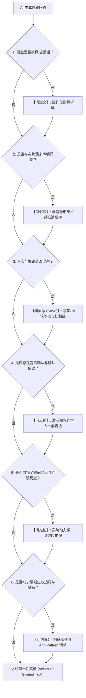

# 苏格拉底六维深度反诘与核验分类学实战手册 (Socratic 6-Dimensional Interrogation & Verification Manual)

> [!NOTE]
> 本手册将古希腊苏格拉底「精神助产术（Maieutic Method）」、理查德·保罗（Richard Paul）批判性思维分类学、以及现代大模型「核验链（Chain of Verification, CoVe）」与「辩证提示（Dialectical Prompting）」深度融合。
> 当大语言模型（LLM）生成回答后，使用本手册的 6 大反诘维度对模型输出实施全方位逻辑解构、假设暴露、反事实证伪与二阶效应推演，彻底穿透模型的“谄媚迎合偏误（Sycophancy）”，逼近第一性物理真值。

---

## 目录
1. [六维反诘全景雷达矩阵](#一六维反诘全景雷达矩阵)
2. [维度一：问定义 · 概念去蔽与操作化 (Conceptual Operationalization)](#二维度一问定义--概念去蔽与操作化-conceptual-operationalization)
3. [维度二：问假设 · 暴露底层脆弱支柱 (Hidden Premise Probing)](#三维度二问假设--暴露底层脆弱支柱-hidden-premise-probing)
4. [维度三：问依据 · 事实与推论隔离核验 (Fact vs. Speculation Isolation & CoVe)](#四维度三问依据--事实与推论隔离核验-fact-vs-speculation-isolation--cove)
5. [维度四：问反例 · 魔鬼代言人与证伪 (Falsification & Devil's Advocate)](#五维度四问反例--魔鬼代言人与证伪-falsification--devils-advocate)
6. [维度五：问推论 · 二阶效应与系统反馈环 (Implications & Cascading Feedback)](#六维度五问推论--二阶效应与系统反馈环-implications--cascading-feedback)
7. [维度六：问边界 · 适用极限与禁忌反模式 (Boundary Conditions & Anti-Patterns)](#七维度六问边界--适用极限与禁忌反模式-boundary-conditions--anti-patterns)
8. [多轮反诘决策拓扑流 (Multi-Turn Interrogation Decision Topology)](#八多轮反诘决策拓扑流-multi-turn-interrogation-decision-topology)

---

## 一、六维反诘全景雷达矩阵

```
                             【问定义】
                        概念去蔽 / 操作化指标
                                ▲
                                │
          【问边界】 ◄───────────┼───────────► 【问假设】
     适用极限 / 禁忌反模式        │        底层未声明支柱 / 脆弱性
                                │
                                ┼
                                │
        【问推论 (二阶)】 ◄──────┼───────────► 【问依据 (CoVe)】
     时间滞后 / 级联反馈环        │        硬事实隔离 / 核验链
                                ▼
                             【问反例】
                       魔鬼代言人 / 极端证伪
```

| 维度编号 | 反诘维度 | 核心批判目标 | 对抗的认知偏见与模型缺陷 |
| :--- | :--- | :--- | :--- |
| **Dim 1** | **问定义** (Definition) | 拆解黑话与泛化词，转化为可量化、可观测的物理指标 | 虚假共识、概念漂移、假大空词汇空转 |
| **Dim 2** | **问假设** (Assumptions) | 揪出未声明的隐含前提，评估底层支柱崩塌时的系统脆弱性 | 顺杆爬偏误、无脑接受用户错误预设 |
| **Dim 3** | **问依据** (Evidence/CoVe) | 物理隔离确凿事实与外推推测，执行独立子问题核验链 | 权威幻觉、存量/增量混淆、虚假数据捏造 |
| **Dim 4** | **问反例** (Falsification) | 强制扮演魔鬼代言人，寻找一票否决的黑天鹅案例与破绽 | 确认偏误（Confirmation Bias）、过度拟合正例 |
| **Dim 5** | **问推论** (Implications) | 推导方案在时间轴与复杂系统中的二阶/三阶级联反应 | 线性思维、短视优化、忽视负反馈阻尼 |
| **Dim 6** | **问边界** (Boundaries) | 锚定方案生效的充要条件、失效临界点与绝对禁止适用场景 | 盲目泛化、一把尺子量所有场景的教条主义 |

---

## 二、维度一：问定义 · 概念去蔽与操作化 (Conceptual Operationalization)

### 1. 深度剖析
大语言模型具有强烈的“词汇平滑性”倾向，极易顺应当前语境生成听起来极其专业但实则毫无操作语义的泛化词（如“敏捷赋能”、“用户体验重塑”、“高可用架构”）。
**问定义的核心动作**：要求模型对核心词汇给出**操作性定义（Operational Definition）**，即“如果一个物理实体或代码模块满足该定义，我们能通过什么客观测量步骤进行确证”。

### 2. 标准反诘句式库
- *“你在回答中反复使用的【X 核心术语】，其最底层的操作性定义（Operational Definition）是什么？”*
- *“如果将【X 核心术语】拆解为 3~4 个可独立观测、可度量、无歧义的硬性技术/业务指标，具体是什么？”*
- *“在你的论述中，【X 概念】与近义概念【Y 概念】的本质区分点与不可逾越的边界在哪里？”*
- *“请分别给出一个 100% 符合【X 概念】的标准样本，以及一个外观相似但判定为‘非 X’的对照反例。”*

### 3. 多领域实战演练
* **商业领域**：
  * *AI 原回答*：“本方案通过**精细化运营**实现用户价值跃迁。”
  * *苏格拉底反诘*：“请将‘精细化运营’拆解为具体的操作步骤：具体追踪哪 5 个用户行为事件埋点？分群触发动作的刷新频率是多少？如何通过 A/B 测试双盲对照组量化其纯增量贡献？”
* **技术架构领域**：
  * *AI 原回答*：“推荐构建**高内聚低耦合**的模块体系。”
  * *苏格拉底反诘*：“在当前代码库中，衡量‘高内聚低耦合’的具体静态指标是什么？是模块间依赖圈复杂度（Cyclomatic Complexity < 10）、对外公开 API 符号数限制在 5 个以内，还是严禁跨域直接读写底层数据库？”

---

## 三、维度二：问假设 · 暴露底层脆弱支柱 (Hidden Premise Probing)

### 1. 深度剖析
模型在回答时通常默认了两个危险前提：
1. **用户的提问前提是正确的**（哪怕用户的前提充满漏洞）。
2. **外部环境是静态、理想且线性可推的**。
**问假设的核心动作**：把结论赖以成立的“隐形地基”挖出来，并测试地基动摇时的承重能力。

### 2. 标准反诘句式库
- *“你的推论建立在哪些未经显式声明的关键前提假设（Hidden Axioms / Preconditions）之上？”*
- *“如果其中最脆弱的一个核心假设发生 180 度逆转或偏离 20%，整套方案的推导逻辑链会在哪个节点最先发生断裂？”*
- *“审视我最初的提问：我的提问中是否包含未经验证的偏见、行业成见或伪命题？若从第一性原理重构该问题，该如何提问？”*
- *“你的推论是否默认了‘零摩擦成本’或‘无限资源供给’？在现实摩擦力存在时，推论是否依然成立？”*

### 3. 多领域实战演练
* **战略投资领域**：
  * *AI 原回答*：“该SaaS产品年增长率达 150%，建议重金跟投以享受网络效应红利。”
  * *苏格拉底反诘*：“该结论默认了‘高增长源于产品真实自驱留存而非高额买量补贴’以及‘客户切换成本足够高’两个假设。如果其实际 Net Retention Rate (NRR) 低于 85%，且 CAC 投资回收期超过 24 个月，原商业飞轮模型是否已经事实上熄火？”

---

## 四、维度三：问依据 · 事实与推论隔离核验 (Fact vs. Speculation Isolation & CoVe)

### 1. 深度剖析与 CoVe（核验链）机制
LLM 往往使用笃定、自信的语调输出，将“权威统计数据”、“行业通识推测”与“模型概率幻觉”混合在一起。
本维度结合了 **Chain of Verification (CoVe)** 的核心思想：
1. **生成核验子问题 (Plan Verification Questions)**。
2. **独立执行核验 (Execute Fact Checks)**。
3. **输出交叉比对表格 (Cross-Verification Table)**。

### 2. 标准反诘句式库
- *“请针对你刚才回答中的全部论据，启动【CoVe 事实隔离核验链】，输出结构化比对表：*
  * *【A 栏：确凿硬事实】（标明具体数据源、样本量 N、发布年份与统计口径）*
  * *【B 栏：推论与模型假设】（标明其推导依据与置信度等级 High/Med/Low）”*
- *“你引用的关键数据是否存在‘幸存者偏差’或‘统计口径自选择效应’？”*
- *“学术界或行业权威独立机构中，是否存在与你当前数据结论完全相反的实证研究（Empirical Study）？其分歧根源是什么？”*

### 3. 多领域实战演练
* **科学数据分析领域**：
  * *AI 原回答*：“数据显示使用该算法后准确率提升了 12%。”
  * *苏格拉底反诘*：“请提供详细的测试基准（Benchmark）：测试集是否存在数据泄露（Data Contamination）？提升 12% 是相对于 SOTA 基线还是弱 Baseline？是否经过了成对 t 检验（p-value < 0.01）？在分布外（OOD）数据集上的泛化退化是多少？”

---

## 五、维度四：问反例 · 魔鬼代言人与证伪 (Falsification & Devil's Advocate)

### 1. 深度剖析
波普尔（Karl Popper）提出：科学理论的本质在于其“可证伪性”。如果一个方案无法被证伪，它就不是严谨的工程方案，而是伪科学宣誓。
**问反例的核心动作**：要求模型彻底背叛用户的正向偏好，站在最挑剔的对手或黑客视角，寻找一票否决的致命破绽。

### 2. 标准反诘句式库
- *“请彻底切换为【魔鬼代言人 (Devil's Advocate) / 首席风控官】视角，列出 3 个能够对你刚才方案实施‘一票否决’的致命反例或攻击向量。”*
- *“在行业历史上，是否存在完美满足你给出的所有成功要素、但最终仍遭遇毁灭性失败的标杆案例？导致其崩盘的深层诱因是什么？”*
- *“如果竞争对手掌握了你这套方案的全部蓝图，他们会采取哪种最非对称的逆向打法来让你彻底破产/失效？”*
- *“在极度恶劣的边缘场景（如网络分区、极端挤兑、雪崩效应）下，该方案表现如何？”*

### 3. 多领域实战演练
* **分布式系统架构领域**：
  * *AI 原回答*：“推荐使用两阶段提交 (2PC) 确保跨微服务数据强一致性。”
  * *苏格拉底反诘*：“请作为混沌工程测试专家，推演以下反例场景：当协调者（Coordinator）在发出 Prepare 成功后但在发出 Commit 前宕机，同时某个参与者发生网络分区时，系统会出现怎样的死锁阻塞与资源耗尽？此时 2PC 方案为何会成为全系统瘫痪的罪魁祸首？”

---

## 六、维度五：问推论 · 二阶效应与系统反馈环 (Implications & Cascading Feedback)

### 1. 深度剖析
一阶思维（First-Order Thinking）只看眼前的直接效果（“做 X 带来 Y”）；而二阶思维（Second-Order Thinking）与系统动力学则追问：“然后呢？当 Y 发生后，系统中的其他主体会产生什么适应性反应？在 6 个月、1 年、3 年后会形成怎样的负反馈阻尼或正反馈恶化？”

### 2. 标准反诘句式库
- *“这套方案在产生眼前直接收益（一阶效应）的同时，会在系统内引发哪些被忽视的【二阶效应（Second-Order Effects）】与【三阶级联反应】？”*
- *“当系统内的人类主体（用户、员工、竞对）针对该方案产生博弈与适应性演化（古德哈特定律：当指标变成目标时就不再是好指标）后，原系统会发生怎样的异化？”*
- *“该方案在时间轴上是否存在‘前期见效极快、后期维护成本指数级爆炸’的滞后性债务（Technical/Organizational Debt）？”*

### 3. 多领域实战演练
* **组织管理与激励机制领域**：
  * *AI 原回答*：“建议按照代码行数与工单关闭数量考核研发团队，以提升产出效率。”
  * *苏格拉底反诘*：“请推演该激励机制在 3 个月后的二阶与三阶反应：工程师是否会倾向于将简单功能拆成海量冗余代码？是否会刻意回避重构复杂遗留 Bug？这会导致系统技术债务与代码腐化速度加快多少倍？”

---

## 七、维度六：问边界 · 适用极限与禁忌反模式 (Boundary Conditions & Anti-Patterns)

### 1. 深度剖析
任何卓越的真理，一旦越过其有效边界，就会蜕变为荒谬的谬误。
**问边界的核心动作**：为方案划定严格的物理围栏，明确其适用的必要条件，并给出不可逾越的“负向反模式清单”。

### 2. 标准反诘句式库
- *“该方案的有效性严格受限于哪些关键参数区间（团队规模下限/上限、吞吐量量级、预算规模、合规级别）？”*
- *“当系统规模或业务并发量上升 10 倍，或预算/时间缩减 70% 时，该方案在哪个明确的度量阈值（Threshold）处会彻底失效？”*
- *“请明确列出 3 条【绝对禁止套用本方案的反模式场景清单 (Anti-Patterns)】。”*
- *“如果用户所处的组织缺乏哪两项核心前置能力，强行推行该方案将必定演变为灾难？”*

### 3. 多领域实战演练
* **研发流程与敏捷转型领域**：
  * *AI 原回答*：“所有团队都应该推行两周一次的 Scrum 敏捷迭代。”
  * *苏格拉底反诘*：“该方案的适用边界是什么？对于芯片研发、航天级嵌入式系统或底层数据库内核开发等试错成本极高、验证周期长达数月的领域，强行推行两周 Scrum 会带来怎样的灾难？请给出明确的禁止适用清单。”

---

## 八、多轮反诘决策拓扑流 (Multi-Turn Interrogation Decision Topology)


