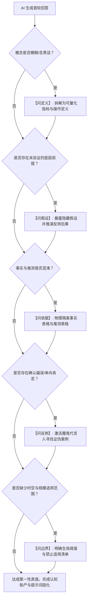

# 苏格拉底五维深度反诘法实战手册 (Socratic 5-Dimensional Interrogation Manual)

> [!NOTE]
> 本手册详细拆解了将古希腊苏格拉底「精神助产术（Maieutic Method）」与理查德·保罗（Richard Paul）批判性思维分类学融合的 **五维深度反诘操作法**。当大模型（LLM）生成第一轮回答后，使用本手册的 5 大维度对模型输出进行层层解构与压力测试，破除未验证假设与讨好偏误，逼近第一性物理真值。

---

## 目录
1. [维度一：问定义 (Conceptual De-abstracting & Clarity)](#一维度一问定义-conceptual-de-abstracting--clarity)
2. [维度二：问假设 (Hidden Premise Probing)](#二维度二问假设-hidden-premise-probing)
3. [维度三：问依据 (Fact vs. Speculation Isolation)](#三维度三问依据-fact-vs-speculation-isolation)
4. [维度四：问反例 (Falsification & Devil's Advocate)](#四维度四问反例-falsification--devil's-advocate)
5. [维度五：问边界 (Boundary Conditions & Applicability)](#五维度五问边界-boundary-conditions--applicability)
6. [五维综合反诘决策树 (Synthesis Decision Tree)](#六五维综合反诘决策树-synthesis-decision-tree)

---

## 一、维度一：问定义 (Conceptual De-abstracting & Clarity)

### 1. 核心目标
大模型极易在回答中使用高概括性、泛化或流行黑话（如“健康化趋势”、“赋能生态”、“降本增效”、“敏捷转型”）。
**问定义的目的**：强制模型将抽象词汇拆解为**可量化、可观测、具有排他性**的具体指标与操作定义。

### 2. 标准反诘句式库
- *“你在结论中提到的【X 概念】，其最严格的操作性定义（Operational Definition）是什么？”*
- *“如果将【X 概念】拆解为 3~4 个可客观量化与落地的判定标准，具体包含哪些？”*
- *“在你的语境中，【X 概念】与相近概念【Y 概念】的核心分水岭与本质区别是什么？”*
- *“请给出一个符合【X 概念】的典型正例，以及一个看似符合但实际上不符合的反例。”*

### 3. 实战案例对比
* **AI 第一轮输出**：“随着消费升级，茶饮行业正呈现出明显的**健康化**趋势。”
* **苏格拉底反诘**：“你所说的‘健康化’具体指什么？如果拆成配料表天然化（0反式脂肪酸）、糖分透明化（低GI/代糖）、功能性添加（益生菌/玻尿酸）以及热量公开四个维度，各品牌在不同维度的实际渗透率与用户感知有何差异？”

---

## 二、维度二：问假设 (Hidden Premise Probing)

### 1. 核心目标
任何推论都建立在底层未声明的假设（Unstated Assumptions）之上。由于大语言模型的“讨好型偏误”，它往往默认用户的提问前提是正确的，并在顺应前提的基础上堆砌论据。
**问假设的目的**：揪出隐藏前提，评估当这些底层支柱崩塌或发生偏移时，原结论是否依然成立。

### 2. 标准反诘句式库
- *“你的这一结论建立在哪些未经显式声明的关键前置假设（Underlying Assumptions）之上？”*
- *“如果其中第 N 个核心假设被证明不成立或发生 180 度逆转，你的最终结论会出现哪些级联变化？”*
- *“我在最开始的提问中，是否存在认知盲区或未经验证的偏见？如果以更客观的视角重新定义本问题，应该如何表述？”*
- *“你的推论是否默认了‘线性外推’假设？在非线性临界点出现时，逻辑断裂点在哪里？”*

### 3. 实战案例对比
* **AI 第一轮输出**：“消费者对健康的关注度飙升，因此推出高定价的草本养生茶饮将获得巨大的市场溢价空间。”
* **苏格拉底反诘**：“你的推论建立在‘消费者的健康关切能直接转化为高溢价支付意愿’这一假设上。但如果消费偏好不等于实际购买决策，且用户在健康茶饮上的价格敏感度反而高于普通奶茶，原商业模型是否会面临致命亏损？”

---

## 三、维度三：问依据 (Fact vs. Speculation Isolation)

### 1. 核心目标
LLM 擅长用流利、笃定的语调混合“确凿事实”与“推论臆测”，造成权威可信的假象。
**问依据的目的**：建立事实隔离墙，强行要求模型对输出中的每一句话进行置信度分级，标明数据出处与推理链条。

### 2. 标准反诘句式库
- *“请将上述回答中的所有陈述，严格划分为【A: 具有公开确凿数据支持的事实】与【B: 基于常识或逻辑的外推推测】两张表格。”*
- *“支持你第 N 个判断的底层样本规模、统计口径以及权威信息源（如财报、行业审计报告、同行评审论文）是什么？”*
- *“这一数据属于存量数据还是增量趋势？是否存在统计学上的幸存者偏差（Survivorship Bias）或样本自选择偏差？”*
- *“是否存在与你引用的数据相冲突的权威研究结果？两者结论产生分歧的技术原因是什么？”*

### 3. 实战案例对比
* **AI 第一轮输出**：“某头部品牌通过下沉市场加盟策略实现了高速增长，门店存活率超过 95%。”
* **苏格拉底反诘**：“95% 存活率的数据统计周期是多长？是开业首年还是三年期？这一数据是品牌官方招商口径还是第三方审计财报数据？如果是闭店未注销或翻牌重开，是否被计入存活？”

---

## 四、维度四：问反例 (Falsification & Devil's Advocate)

### 1. 核心目标
波普尔证伪主义表明：无法被证伪的理论不是科学。LLM 会顺应提示词寻找支持性论据，形成认知茧房。
**问反例的目的**：强制模型扮演“魔鬼代言人（Devil's Advocate）”，主动寻找证伪证据、黑天鹅案例与逻辑反例，检验结论的鲁棒性。

### 2. 标准反诘句式库
- *“如果站在反方立场的顶级辩手视角，会提出哪 3 个最致命的反驳论点来击穿你的结论？”*
- *“在行业历史或现实商业世界中，是否存在完全满足你给出的所有成功条件，但最终却彻底溃败的典型反例？”*
- *“有什么潜在的新变量或极端边缘场景（Edge Case），足以一票否决你刚才给出的整套方案？”*
- *“请寻找 2 个与你刚才推荐的主流路径完全相反、但同样取得重大成功的逆向异类案例。”*

### 3. 实战案例对比
* **AI 第一轮输出**：“所有大模型应用都必须优先采用 RAG（检索增强生成）架构来消除幻觉。”
* **苏格拉底反诘**：“请作为魔鬼代言人，列出 3 类 RAG 架构不仅无法解决问题反而引入灾难性后果的场景（例如超长上下文时序推理、动态图谱关系计算），并说明在此类场景下哪些原生 Long-Context 或精调方案表现更优。”

---

## 五、维度五：问边界 (Boundary Conditions & Applicability)

### 1. 核心目标
世上不存在放之四海而皆准的万能结论。每个战略、架构或技术方案都有其适用的生命周期、规模边界与环境约束。
**问边界的目的**：为模型输出加装“安全围栏”，明确其生效的充分必要条件与失效阈值。

### 2. 标准反诘句式库
- *“你给出的这套方案，其有效性严格受限于哪些边界条件（如组织规模、技术成熟度、预算量级、业务阶段、地理区域）？”*
- *“当系统负载/业务规模扩大 10 倍，或预算缩减 80% 时，该方案在哪个临界点会发生结构性失效？”*
- *“在哪些特定场景下，直接套用你的方案会带来反效果（Anti-Pattern）？请列出明确的【禁止适用场景清单】。”*
- *“从方案生效到失效，是否存在一个明确的度量指标阈值（Threshold）？该阈值如何监控？”*

### 3. 实战案例对比
* **AI 第一轮输出**：“推荐采用微服务架构拆分当前系统，以提高研发并行度与系统可用性。”
* **苏格拉底反诘**：“该建议适用的团队规模与业务复杂度下限是多少？如果研发团队人数不足 10 人，且日均调用量低于 100 万次，微服务带来的分布式事务开销、运维复杂度与网络延迟成本是否会超过其收益？”

---

## 六、五维综合反诘决策树 (Synthesis Decision Tree)

