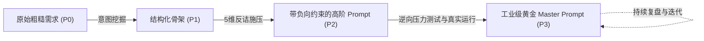

# 现代前沿提示词架构体系与设计模式 (SotA Prompt Frameworks & Design Patterns)

> [!NOTE]
> 本参考指南梳理了现代大语言模型（Claude 3.5/3.7、GPT-4o/o1/o3、Gemini 1.5/2.0/3.0 等）的主流提示词工程学框架、XML 结构化封装范式以及苏格拉底思维链（Socratic CoT）结合模式，为构建工业级 Master Prompt 提供权威架构支撑。

---

## 目录
1. [主流提示词框架图谱与选型矩阵](#一主流提示词框架图谱与选型矩阵)
2. [XML 结构化标签封装规范 (Industry Standard)](#二xml-结构化标签封装规范-industry-standard)
3. [苏格拉底思维链 (Socratic CoT) 与后退提问 (Step-Back)](#三苏格拉底思维链-socratic-cot-与后退提问-step-back)
4. [元提示词 (Meta-Prompting) 演进闭环](#四元提示词-meta-prompting-演进闭环)

---

## 一、主流提示词框架图谱与选型矩阵

| 框架名称 | 核心要素构成 | 最优适用场景 | 局限性与苏格拉底改良点 |
| :--- | :--- | :--- | :--- |
| **CRISPE** | **C**apacity (角色能力), **R**equest (核心请求), **I**nsight (背景洞察), **S**tatement (陈述细节), **P**ersonality (性格基调), **E**xperiment (测试范例) | 复杂多角色扮演、专业咨询输出 | 容易堆砌角色形容词，缺乏硬性边界约束。需引入【负向戒律】。 |
| **TAG** | **T**ask (核心任务), **A**ction (执行动作), **G**oal (终极目标) | 极简自动化脚本、单轮工具函数调用 | 缺乏上下文与反思过程，易产生幻觉。需引入【思考链 CoT】。 |
| **RTF** | **R**ole (角色), **T**ask (任务), **F**ormat (格式规范) | 报表生成、结构化数据清洗、格式转换 | 逻辑推理深度不足。需补充【假设验证环节】。 |
| **TRACE** | **T**arget (目标), **R**ole (角色), **A**udience (受众), **C**onstraints (限制条件), **E**xamples (范例) | 商业文案、PRD 需求撰写、战略报告 | 样本容易引发模型过度拟合。需引入【反例 Few-Shot】。 |
| **Socratic-Master (本技能)** | **意图第一性 + 5维反诘 + XML容器 + 逆讨好注入 + 认知闭环** | 工业级系统 Prompt、复杂业务架构、深度认知决策 | **全场景通用**：兼具结构严密性与深度反思性。 |

---

## 二、XML 结构化标签封装规范 (Industry Standard)

顶级大模型（尤其是 Anthropic Claude 与 OpenAI / Google 新代模型）对 XML 标签具有极强的语义解析与指令隔离能力。本技能推荐采用标准化 XML 标签容器：

```xml
<master_prompt>
  <!-- 1. 核心定位与心智认知 -->
  <system_role>
    你是...（角色定义、核心能力圈、思维方式）
  </system_role>

  <!-- 2. 业务背景与上下文信息 -->
  <context_and_intent>
    当前面临的业务/技术背景，第一性原则目标...
  </context_and_intent>

  <!-- 3. 执行任务与操作步骤 (SOP) -->
  <workflow_and_task>
    <step index="1" name="概念解构">...</step>
    <step index="2" name="五维反诘">...</step>
    <step index="3" name="方案生成">...</step>
  </workflow_and_task>

  <!-- 4. 负向约束与红线规则 (Crucial) -->
  <negative_constraints>
    - 严禁...（禁止使用的词汇/假设）
    - 严禁盲目迎合用户未证实的先验假设
    - 必须区分事实与推论
  </negative_constraints>

  <!-- 5. 结构化输入插槽 -->
  <input_data>
    {{USER_INPUT}}
  </input_data>

  <!-- 6. 输出契约与格式规范 -->
  <output_contract>
    必须遵循以下 Markdown 结构或 JSON Schema 规范输出...
  </output_contract>
</master_prompt>
```

---

## 三、苏格拉底思维链 (Socratic CoT) 与后退提问 (Step-Back)

### 1. 苏格拉底思维链 (Socratic Chain-of-Thought)
在提示词中强制注入 `<thinking_process>`，要求大模型在输出最终答案前，先在内部进行 4 步自我审问：
1. **Premise Check (前提检查)**：用户的问题是否隐含未证实的先验偏见？
2. **Deconstruction (概念拆解)**：核心词汇是否存在歧义或泛化黑话？
3. **Falsification Probe (反事实探针)**：在什么极端边界或反例下，当前解法会失效？
4. **Synthesis (去蔽提炼)**：基于物理真值整合答案，而非基于最顺滑的词汇补全。

### 2. 后退提问策略 (Step-Back Prompting)
面对高度复杂或细节繁琐的问题，提示词应引导模型先“后退一步（Step Back）”，追问更高维度的抽象原则：
* *“在解决这个具体的 Bug/商业策略前，先抽象出其所属领域的底层第一性原理是什么？”*
* *“该类问题在计算机科学/微观经济学中的经典解法与数学极限是什么？”*

---

## 四、元提示词 (Meta-Prompting) 演进闭环

元提示词（Prompt about Prompts）是指用提示词来生成、审计、重构提示词本身的工程学闭环。



1. **生成阶段 (Generation)**：将用户一句话灵感转化为包含角色、背景、步骤、约束的标准 XML Prompt。
2. **审查阶段 (Audit & Linting)**：检查 Prompt 中是否存在模糊动词（如“妥善处理”、“合理优化”）、缺少边界、缺乏格式约束等漏洞。
3. **校准阶段 (Few-Shot Calibration)**：补充 1~2 个最能体现严谨性与反思深度的高质量正反范例。
