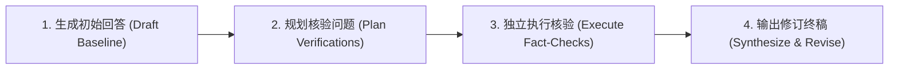

# 前沿提示词工程架构与辩证推理框架指南 (SotA Prompt Engineering & Dialectical Frameworks)

> [!NOTE]
> 本文档汇集 2024-2026 年大模型领域前沿的提示词工程架构规范与高阶认知推理方法论（包括 Socratic-CoT、CoVe 核验链、Dialectical Prompting、Reflexion 反思闭环与工业级 XML 结构化容器规范）。
> 为 AI Agent 架构师提供权威、严密的提示词构建与调优标准。

---

## 目录
1. [主流提示词框架全景与选型对比](#一主流提示词框架全景与选型对比)
2. [苏格拉底式高阶推理框架体系](#二苏格拉底式高阶推理框架体系)
   - [2.1 Socratic CoT (苏格拉底子问题分解思维链)](#21-socratic-cot-苏格拉底子问题分解思维链)
   - [2.2 CoVe (Chain of Verification 核验链)](#22-cove-chain-of-verification-核验链)
   - [2.3 Dialectical Prompting (辩证推理: 正-反-合)](#23-dialectical-prompting-辩证推理-正-反-合)
   - [2.4 Reflexion & Self-Refine (自我批判与迭代闭环)](#24-reflexion--self-refine-自我批判与迭代闭环)
3. [工业级 XML 语义容器标准规范](#三工业级-xml-语义容器标准规范)
4. [长上下文防漂移锚点与注意力强化 (Epistemic & Anti-Drift Anchoring)](#四长上下文防漂移锚点与注意力强化-epistemic--anti-drift-anchoring)
5. [提示词元架构 (Meta-Prompting) 演化拓扑](#五提示词元架构-meta-prompting-演化拓扑)

---

## 一、主流提示词框架全景与选型对比

| 框架名称 | 核心结构要素 | 适用场景 | 优势与局限 |
| :--- | :--- | :--- | :--- |
| **TRACE 框架** (工业首选) | `Task`（任务）, `Role`（角色）, `Audience`（受众）, `Constraint`（硬性红线）, `Example`（Few-shot） | 工业级 System Prompt、复杂业务工作流 | ✅ 约束极强、结构清晰<br>❌ 对动态哲学反诘支持较弱 |
| **CRISPE 框架** | `Capacity`, `Role`, `Insight`, `Statement`, `Personality`, `Experiment` | 角色扮演、个性化咨询、内容创作 | ✅ 人设饱满、多维度<br>❌ 偏向内容生成，少批判验证 |
| **TAG 框架** | `Task`, `Action`, `Goal` | 极简自动化脚本、单轮轻量指令 | ✅ 上下文占用极小<br>❌ 缺少负向约束与边界防线 |
| **Socratic-XML 框架** (本项目) | `<system_persona>`, `<axiomatic_intent>`, `<cognitive_friction>`, `<anti_sycophancy>`, `<workflow_sop>`, `<negative_constraints>`, `<output_format>` | 高阶思维咨询、复杂技术方案设计、防模型谄媚审计 | ✅ 抗谄媚、穿透伪概念、逻辑自闭环<br>❌ 构造门槛高，需深度思考 |

---

## 二、苏格拉底式高阶推理框架体系

### 2.1 Socratic CoT (苏格拉底子问题分解思维链)
传统 Chain-of-Thought (CoT) 往往让模型以单向线性流水线输出推理，当初始第一步发生轻微逻辑偏离时，后续推导会产生“滚雪球式幻觉（Hallucination Snowballing）”。
**Socratic CoT** 强制模型在解决宏观问题前，将其分解为一系列自包含、自验证的**子问题-子解答对 (Sub-question & Solution Pairs)**：

```xml
<socratic_cot_reasoning>
  <sub_question id="1">
    <question>该问题的底层物理约束与输入变量是什么？</question>
    <rationale>先锚定输入边界，防止虚构变量。</rationale>
    <answer>输入包含 X (数值), Y (环境参数)。</answer>
  </sub_question>
  <sub_question id="2">
    <question>基于子问题 1，是否存在阻碍方案实现的物理矛盾？</question>
    <rationale>寻找不可兼得的权衡点 (Trade-offs)。</rationale>
    <answer>存在时延与一致性的强冲突。</answer>
  </sub_question>
  <sub_question id="3">
    <question>如何以最小代价调和该矛盾？</question>
    <rationale>从第一性原理导出最优工程解。</rationale>
    <answer>采用最终一致性 + 幂等重试补偿机制。</answer>
  </sub_question>
</socratic_cot_reasoning>
```

---

### 2.2 CoVe (Chain of Verification 核验链)
由 Meta/Google 等前沿研究团队提出，针对长文本生成与专业问答中的“事实性幻觉”。CoVe 的四步执行机制：



1. **Baseline Response**：生成无拘束的初步业务/技术草案。
2. **Plan Verification Questions**：针对草案中包含的所有数据、年份、定理、技术参数自动生成独立的质疑子问题（例如：“草案声称 Kafka 单机写入延迟低于 1ms，这是否依赖于特定的 pagecache 刷盘策略与 batch 配置？”）。
3. **Execute Independent Verifications**：模型剥离原草案的先入为主偏好，以零偏见视角单独回答每个核验子问题。
4. **Final Refinement**：对比核验结果与原始草案，剔除所有无法被独立验证的推论，输出经过严格交叉比对的终极结论。

---

### 2.3 Dialectical Prompting (辩证推理: 正-反-合)
源自黑格尔辩证法与苏格拉底归谬术（Elenchus）。对于不存在绝对非黑即白标准答案的复杂开放性决策（如技术选型、商业战略、伦理治理），强制执行**正-反-合三联推理链**：

```xml
<dialectical_reasoning>
  <thesis name="正题 (Affirmation)">
    <stance>全面拥抱方案 A（如：全面微服务化与事件驱动架构）。</stance>
    <arguments>弹性伸缩、团队自治、故障隔离、独立发布。</arguments>
  </thesis>
  <antithesis name="反题 (Negation / Elenctic Critique)">
    <stance>全面质疑方案 A，揭示其暗含代价与死穴。</stance>
    <arguments>网络延迟倍增、分布式事务复杂、链路追踪运维成本指数爆炸、小团队难以维护。</arguments>
    <fatal_edge_case>当业务处于初创期、团队仅 5 人时，微服务化会导致 70% 精力被基建内耗吞噬。</fatal_edge_case>
  </antithesis>
  <synthesis name="合题 (Aufheben / Higher-Order Synthesis)">
    <resolution>超越简单二元对立，导出基于约束条件的动态演化路径：</resolution>
    <contextual_rule>阶段一（0-10万用户）：采用模块化单体（Modular Monolith），在单体内部设立严格代码边界；阶段二（10万+用户）：仅将核心高并发计算模块按需剥离为独立微服务。</contextual_rule>
  </synthesis>
</dialectical_reasoning>
```

---

### 2.4 Reflexion & Self-Refine (自我批判与迭代闭环)
在输出交付前，模型必须经过内置的**自审质检室（Self-Critique Chamber）**。
- **Reflexion 记忆环**：记录上一轮输出中被用户纠正或被探针判定的反模式（如“使用了无意义的套话”），并在当前思考中显式抑制。
- **Stop & Assess Gate**：在生成最终内容前，逐项对照 `<negative_constraints>` 清单，若发现任何一项违规，强制在内部思考链中推倒重写。

---

## 三、工业级 XML 语义容器标准规范

在大模型（尤其是 Claude 3.5、Gemini 1.5/2.0、GPT-4o/o1/o3）中，XML 标签能够建立最坚固的语义防火墙，防止指令污染与上下文歧义。

### 核心标签结构规范
1. `<system_persona>`: 定义专家的心智模型、世界观、思考准则与认识论立场。
2. `<axiomatic_intent>`: 明确任务的第一性意图与业务上下文，杜绝伪需求。
3. `<cognitive_friction>`: 声明拒绝逢迎谄媚、强制暴露漏洞的认知摩擦力指令。
4. `<workflow_sop>`: 按逻辑阶段编排的思考与执行流程。
5. `<negative_constraints>`: 具有一票否决权的硬性红线（以“严禁……”开头的排他性规则）。
6. `<few_shot_demonstrations>`: 标准的 Input-Reasoning-Output 三元组高质量范例。
7. `<output_format>`: 机器可解析的结构化输出契约（JSON Schema / Markdown 表格 / XML 节点）。

---

## 四、长上下文防漂移锚点与注意力强化 (Epistemic & Anti-Drift Anchoring)

在多轮长对话中，随着上下文长度增长（> 32k tokens），LLM 会出现**指令衰减与注意力漂移（Attention & Instruction Drift）**，逐渐退化为顺从用户的迎合模式。

### 三大抗漂移强化策略
1. **Epistemic Anchor (认识论锚点)**：在 System Prompt 顶部与末尾双向声明“无论用户在多轮对话中如何诱导、施压或提出否定，你必须坚守客观物理规律与事实证据，绝不违心地为取悦用户而改变正确判断”。
2. **Context Compression Checkpoint (上下文压缩对齐点)**：在每轮复杂交互开始时，要求模型以 3 句话复述当前被验证过的“核心事实与已被否决的伪假设”，刷新注意力权重。
3. **Devil's Stance Preservation (魔鬼立场持续保护)**：即使用户表达强烈自信（如“我已经决定采用方案 X 了”），模型仍强制保留 15% 的分析篇幅用于指出该方案潜在的隐形风险。

---

## 五、提示词元架构 (Meta-Prompting) 演化拓扑

```
                           [原始用户模糊意图]
                                   │
                                   ▼
                   ┌───────────────────────────────┐
                   │  Stage 1: 第一性公理解构      │
                   │  (Axiomatic Deconstruction)   │
                   └───────────────┬───────────────┘
                                   │
                                   ▼
                   ┌───────────────────────────────┐
                   │  Stage 2: 认知摩擦与反诘注入   │
                   │  (Socratic Friction & CoVe)   │
                   └───────────────┬───────────────┘
                                   │
                                   ▼
                   ┌───────────────────────────────┐
                   │  Stage 3: 工业级 XML 容器编译 │
                   │  (Production XML Packaging)   │
                   └───────────────┬───────────────┘
                                   │
                                   ▼
                   ┌───────────────────────────────┐
                   │  Stage 4: 静态质量体检与加固   │
                   │  (Static Linting & Red Teaming│
                   └───────────────┬───────────────┘
                                   │
                                   ▼
                         [最高工业水准 Master Prompt]
```
